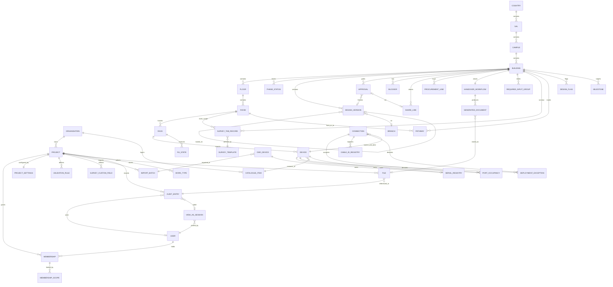

# Rackium data model (MongoDB + Mongoose)

Written for: the engineers building the backend. This is the contract the backend must satisfy. It is derived from the prototype's mock store (`client/src/mock/`, `client/src/api/`, `client/src/lib/`), the v2.3 brief (`docs/RACKIUM-BRIEF-v2.3.md`) and the client audit. It defines schema and rules. It contains no backend code.

**Source tags** on every entity or field group:

- **[M]** exists in the prototype's mock store; the shape comes from the code.
- **[B]** specified in the brief only, with no mock yet.
- **[C]** client audit addition, with no UI or mock yet.
- **[Dn]** a client decision from the decision review. Each is applied in the entity section where it lives. §12 maps each decision to its section.

---

## 0. Conventions

| Topic | Rule |
|---|---|
| Identifiers | `ObjectId` for every `_id`. References are `ObjectId` with `ref`. Human codes (`TR-EG-01`, `R01`, `E-DE-ERL-C01-B001-EG-001`, `PP-01`, cable IDs) are attributes, never `_id`. Readable seed IDs in the prototype (`b001-eg`, `dev-fusion`) are seed conventions only. |
| Dates | `Date`, stored in UTC. Date-only values (`dueDate`, `eolDate`, `warrantyEnd`) are stored as UTC midnight and displayed as the calendar date. |
| Enums | `String` with a Mongoose `enum` validator. Labels are UI concerns. |
| Money | `Number` in integer minor units, plus `currency` (ISO-4217) on the same document. |
| Embedding | Embed what is owned by one parent and read with it: connection hops, device installation, device DGUV, device lifecycle, device checklist, room survey facts, rack details, required-input entries, approval decision. Use a separate collection for anything with its own lifecycle or query path, or unbounded growth: audit entries, files, survey tab records, approvals, and the three registries. `Mixed` is avoided; survey field values carry a typed `value` (§5.4). |
| Case-insensitive uniqueness | Unique index with collation `{ locale: 'en', strength: 2 }`. Queries that rely on the index pass the same collation. Values are trimmed on write. |
| Transactions | Multi-document transactions need a replica set (Atlas or a replica set in development). Writes described as "same transaction" use a session. |
| Deletion | Soft delete (`deletedAt`) for customer data. The only hard delete is the GDPR organisation purge (brief §6.11), a resumable job. |

---

## 1. Tenancy and access

### 1.1 Scope fields

Every tenant document carries `organisationId` (ObjectId, required) and `projectId` (ObjectId, required), except the global collections in §1.3. The scope is denormalised onto every row so queries and indexes never need a join to find a tenant.

### 1.2 Tenant plugin (replaces row-level security)

One Mongoose plugin, `tenantScope`, is applied to every tenant model. It is the only route to tenant data.

- **Required scope.** A query without `organisationId` and `projectId` in the request context throws before reaching the database. Tenant models have no unscoped query path.
- **Organisation-level read** [F2]. A request carrying an organisation-level Org Admin context is scoped to `organisationId` only and may read any project in it. It may write project records only with a project-level membership.
- **Filter injection.** The plugin adds `{ organisationId, projectId }` to the filter of `find`, `findOne`, `findById`, `countDocuments`, `updateOne`, `updateMany`, `findOneAndUpdate`, `deleteOne` and `deleteMany`. For `aggregate`, it prepends a `$match` on the same fields.
- **Write checks.** On `save`, `insertMany` and `bulkWrite`, the plugin rejects a document whose scope differs from the request context.
- **Immutable scope.** `organisationId` and `projectId` cannot change on an existing document.
- **View-As is read-only.** In a View-As session (§1.6), the plugin rejects every write.
- **Audit is append-only.** Updates and deletes on `auditEntries` throw, except the GDPR purge job (§8.4).

### 1.3 Scope classes

| Class | Models | Scope |
|---|---|---|
| Tenant, project scope | Everything in §2 with `projectId`, including `memberships`, `invitations`, `viewAsSessions`, `projectSettings`, `validationRules` (project rules), `workTypes` (custom) | `organisationId` + `projectId` |
| Tenant, organisation scope | `organisations` (settings), `memberships` at organisation level, `validationRules` (organisation rules), `catalogueItems` in the `organisation` layer | `organisationId` |
| Global, platform-owned | `surveyTemplates`, `documentTypes`, `workTypes` (predefined), `catalogueItems` in `seeded` and `servon` layers | none. Read-only to customers. |
| Global, identity | `users` | none. A user can hold memberships in several organisations. |

### 1.4 Rackium Team — platform admin [D8]

- Rackium Team is an account type: `users.accountType = 'rackium_team'`. It sits **outside organisation tenancy** and has no membership.
- To read or write an organisation's data, a Rackium Team user opens a **platform context** naming the organisation and project. Only inside that context does the tenant plugin accept the scope.
- **Every access is audit-logged, reads included.** Each access writes an `auditEntries` document: `actor.type = 'rackium_team'`, `changeType = 'platform_access'`, the organisation and project, the collection, the operation, and a required `comment` holding the reason.
- A platform context cannot approve or submit through the normal UI. Any change it makes is audited like any other change.

### 1.5 Isolation tests (required before release)

Run in CI against a replica set, with two organisations of two projects each.

1. A query without scope throws, for every tenant model (generated, one test per model).
2. `findById` with a valid ID from another organisation returns nothing and does not reveal the ID exists.
3. `findById` with a valid ID from another project in the same organisation returns nothing.
4. An insert with a mismatched `organisationId` or `projectId` is rejected.
5. An aggregate without scope throws. An aggregate with scope cannot read another tenant.
6. Changing `organisationId` or `projectId` on an existing document is rejected.
7. A View-As session cannot write through any model.
8. An audit entry cannot be updated or deleted.
9. A Rackium Team read outside a platform context is rejected. Inside one, each operation writes exactly one platform-access audit entry.
10. Unique indexes reject duplicates within a project and allow the same value in another project (cable IDs, serials, hostnames).
11. Case-insensitive uniqueness: `cable-1` and `CABLE-1` collide inside a project and do not collide across projects.
12. An Org Admin without a project membership reads every project in the organisation and writes no project record.
13. The user who creates a project holds the PM membership for it, created in the same transaction.

### 1.6 Users, memberships, invitations and View As

**`users`** [C; brief §4.3]

- `email` (R, unique, case-insensitive) · `name` (R) · `accountType` (`customer` / `rackium_team`, R, default `customer`) · `status` (`invited` / `active` / `disabled`, R) · `lastLoginAt` (Date, O) · `mfaEnabled` (Boolean; required to be true for `org_admin`, `pm` and `architect`, brief §8.1) · `createdAt` (Date, R).
- No credentials on this document. Authentication is a separate concern (brief §8.1).

**`memberships`** [C; D5, F2] — two levels.

- `organisationId` (R) · `projectId` (O; **null for organisation level**) · `userId` (R) · `level` (`organisation` / `project`, R) · `role` (R; organisation level: `org_admin`; project level: `pm`, `architect`, `reviewer`, `field_engineer`, `viewer`) · `invitedBy` (O) · `createdAt` (R) · `revokedAt` (O).
- **Organisation level** [F2]: Org Admin manages users, organisation settings and the catalogue, and has **read access to every project in the organisation**. An Org Admin has **no design approval rights** unless also given a project role.
- **Project level** [F2, D5]: PM, Architect, Reviewer, Field Engineer and Viewer. Memberships are per project. The embedded `scopes[]` (`{ type: 'country' | 'sal' | 'building', refId }`) limit the membership. **An empty `scopes` array means the whole project** [D5]. Scopes are additive.
- **Project creator** [F2]: the user who creates a project becomes its PM. The PM membership is created in the same transaction as the project (§10).
- A user may hold one organisation-level membership and any number of project-level memberships.
- Unique: `(organisationId, userId)` where `level = organisation` and `revokedAt` is null; `(projectId, userId)` where `level = project` and `revokedAt` is null.
- Brief §4.3 and §2.6: a Field Engineer scoped to one building sees only that building.

**`invitations`** [C]

- `organisationId` · `projectId` (R) · `email` (R, case-insensitive) · `role` (R) · `scopes[]` (as above) · `invitedBy` (R) · `tokenHash` (R, unique; SHA-256 of a 32-byte random token, as in §5.5) · `expiresAt` (Date, R) · `status` (`pending` / `accepted` / `expired` / `revoked`, R) · `acceptedAt` (Date, O).
- Accepting an invitation creates a membership. An expired or revoked invitation cannot be accepted.

**`viewAsSessions`** [C; brief-adjacent audit requirement]

- `organisationId` · `projectId` (R) · `actorUserId` (R) · `viewedRole` (R, one of the six roles) · `startedAt` (Date, R) · `endedAt` (Date, O).
- **View-as is view-only.** The plugin rejects writes in the session (§1.2). The actor's own role, not the viewed role, is what gets audited.
- Every start and end writes an audit entry (`view_as.started`, `view_as.ended`, `changeType = view_as_access`). Every audit entry created inside a session carries `viewAsSessionId`.
- The prototype's role switcher (`lib/RoleContext.jsx`) is client-side state with no user binding and no audit (§13).

---

## 2. Collections

| Collection | Purpose | Embeds | References | Unique indexes (case-insensitive where stated) |
|---|---|---|---|---|
| `organisations` | tenancy root, org settings | `settings` | — | `_id` |
| `users` | people and platform accounts | — | — | `email` |
| `memberships` | organisation-level and project-level roles | `scopes[]` | user, organisation, project | `(projectId, userId)` for project level; `(organisationId, userId)` for organisation level |
| `invitations` | pending access grants | `scopes[]` | project, inviter | `tokenHash` |
| `viewAsSessions` | view-only role switch | — | user, project | — |
| `projects` | project, active phases | `activePhases[]`, `workTypeIds[]` | organisation | `(organisationId, code)` |
| `projectSettings` | one per project | general, hierarchy, roles, naming, resource minutes, margin, cord override | project | `projectId` |
| `workTypes` | predefined (global) and custom (per project) work types | `phaseMapping[]` | project (custom) | `key` (predefined); `(projectId, name)` (custom) |
| `validationRules` | structured custom rules | — | project or organisation | — |
| `countries`, `sals`, `campuses` | hierarchy | — | parent | `(projectId, code)` |
| `buildings` | building and site size | — | campus | `(projectId, code)` |
| `wings` (optional) | §3.5 | — | building | `(buildingId, code)` |
| `floors` | floor and token | — | building, wing | `(buildingId, token)`, `(buildingId, order)` |
| `rooms` | room and survey facts | `survey` | floor, building | `(buildingId, code)` |
| `racks` | rack and survey facts | `details`, `mountingPower`, `cablePath`, `accessibility` | room, building | `(roomId, code)` |
| `devices` | network devices, patch panels, PDUs, cable managers, APs | `installation`, `dguv`, `lifecycle`, `portExceptions[]`, `provenance` | rack, room, building, catalogue key | `(projectId, hostname)` |
| `connections` | device-to-device links | `hops[]`, `lengths` | devices and ports | — (uniqueness through registries) |
| `pathways` | room-to-room routes [S5 rename] | — | rooms | `(projectId, roomLowId, roomHighId)` |
| `cableIdRegistry` | cable IDs and hop segment IDs | — | connection, hop | `(projectId, cableId)` |
| `portOccupancy` | which device port is in use | — | device, connection | `(projectId, deviceId, portId)` |
| `serialRegistry` | serials across CMO and devices | — | owner | `(projectId, serial)` |
| `ruStates` | reserved and blocked RUs [D1] | — | rack | `(projectId, rackId, ru, face)` |
| `catalogueItems` | layered catalogue | `portMap`, `mediaSpeed`, `stock` | organisation, project | `(layer, organisationId, projectId, kind, key)` |
| `importBatches` | CMO and lifecycle imports | — | uploader, file | — |
| `cmoDevices` | CMO inventory | — | batch, building, rack | via `serialRegistry` |
| `surveyTemplates` | 18-tab definitions, versioned, global | `tabs[]` | — | `(templateKey, version)` |
| `surveyTabRecords` | one per tab per building or room | `sections[]` (with `fieldValues`, `rows`) | building, room | `(projectId, buildingId, roomId, tab)` |
| `surveyCustomFields` | Org Admin fields per tab | — | project | `(projectId, tab, key)` |
| `designFlags` | e.g. survey changed after import [D2] | — | building | `(buildingId, kind, surveyTabRecordId)` |
| `phaseStatuses` | approval phases only | — | building | `(buildingId, phaseKey)` |
| `phaseTargets`, `milestones` | dates and SLA [C] | — | building | `(buildingId, phaseKey)` |
| `approvals` | one per gate | `decision`, `client` | design version, share link | — |
| `shareLinks` | client link, hashed token [D15] | `extensions[]` | building | `tokenHash` |
| `blockers` | human-raised blockers [C] | — | related object | — |
| `tasks` | assigned work [C] | — | users, related object | — |
| `notifications` | per-user alerts [C] | — | recipient | `(recipientId, readAt, createdAt)` |
| `notificationPreferences` | delivery settings [C] | — | user | `(userId, projectId, eventType, channel)` |
| `requiredInputGroups` | 12 groups per building | `addressingEntries[]`, `kvPairs[]` | building | `(buildingId, groupKey)` |
| `acceptedWarnings` | accepted validation warnings | — | building | — |
| `procurementLines` | serialised devices and consumables [D6] | — | building, device | `(buildingId, deviceId)` and `(buildingId, consumableKey)` |
| `designVersions` | HLD, LLD, SP, BOM versions | `changeSummaries[]` | building, branch, based-on version | `(buildingId, designType, number)` |
| `branches` | design branches | — | building, version | — |
| `handoverWorkflows` | one per building | `baseline` | building | `buildingId` |
| `generatedDocuments` | document outputs | — | building, file | — |
| `documentTypes` | the 11 handover types and SP sections | — | — | global seed |
| `deploymentExceptions` | install deviations | — | device, connection | — |
| `files` | photos, PDFs, sheets, signatures | — | attached object (polymorphic) | `storageKey` |
| `auditEntries` | one per user action [D10] | `changes[]` | actor, object | — (append-only) |

---

## 3. Hierarchy and project

### 3.1 Organisation [M `hierarchy.js` `organisation`] (brief §4.1)

| Field | Type | Req | Allowed / format | Default | § | Src |
|---|---|---|---|---|---|---|
| `name` | String | R | | | §4.1 | M |
| `defaultCurrency` | String | R | ISO-4217 | `EUR` | §5.6 | B |
| `settings.cordLengthDefaultM` | Number | R | > 0 | `2` | §6.7 | M (hard-coded) |
| `settings.powerCordStandardDefault` | `{ label, connectorPair }` | O | [D16] | null | §6.7 | M shape |
| `settings.uploadLimitsMb` | `{ photo, pdf, sheet }` | R | [D12] configurable | `{ 15, 25, 10 }` | §5.2 | C |
| `settings.standardHeightsU` · `settings.customHeightsU` | `[Number]` | R / O | [§3.8] | `[12,24,42,45,48]` / `[]` | §4.1 | B |
| `deletedAt` · `gdprDeletionRequestedAt` | Date | O | soft delete, purge within 30 days | null | §6.11 | B |

### 3.2 Project [M `hierarchy.js` `project`] (brief §4.3: Org Admin or PM creates projects)

| Field | Type | Req | Allowed / format | Default | Src |
|---|---|---|---|---|---|
| `organisationId` | ObjectId | R | | | M |
| `name` | String | R | | seed `LANspire` | M |
| `code` | String | O | unique per organisation, case-insensitive | | C |
| `status` | String | R | `active` / `archived` | `active` | C |
| `workTypeIds` | `[ObjectId]` | O | refs `workTypes` (§3.10) [D4] | `[]` | C |
| `activePhases` | `[{ phaseKey, position }]` | R | ordered, non-empty subset of the nine phase keys; `position` unique | all nine, in order | C |
| `createdBy` · `createdAt` | ObjectId · Date | R | | | B |

**Phase gating** [D3] — the project's active phases in order define the sequence. **Pending client confirmation.** The default:

- A PM may **add** any phase that has not started.
- A phase **that contains data cannot be removed**. A phase contains data when its `phaseStatuses` row is not `not_started`, or when it owns any record (survey tab records, approvals, procurement lines, deployment exceptions).
- Progress, the sidebar and the dashboard use only active phases.
- Which phase blocks which, and whether an active phase may be skipped, follows the same order and waits on the same confirmation.

### 3.3 Country, SAL, Campus [M `hierarchy.js`] (brief §4.1)

- `countries`: `projectId` (R) · `code` (R, e.g. `DE`) · `name` (R, e.g. `Germany`). Unique `(projectId, code)`, case-insensitive.
- `sals`: `countryId` (R) · `projectId` (R) · `code` (R, e.g. `ERL`). Unique `(countryId, code)`. SAL-level devices (the Unassigned CMO list) hang here.
- `campuses`: `salId` (R) · `projectId` (R) · `code` (R, e.g. `C01`). Unique `(salId, code)`.

### 3.4 Building [M `hierarchy.js` `buildings[]`] (brief §4.1, §7.3)

| Field | Type | Req | Allowed / format | Default | § | Src |
|---|---|---|---|---|---|---|
| `campusId` · `projectId` · `organisationId` | ObjectId | R | | | | M / B |
| `code` | String | R | e.g. `B001`; unique per project, case-insensitive | | §4.1 | M |
| `name` | String | R | | | | M |
| `siteSize` | String | R | `S` (collapsed core). Other sizes are not defined in the brief, so only `S` is valid until they are. | `S` | §5.3 | M |
| `lastSyncAt` | — | C | max `auditEntries.occurredAt` for the building | | §7.3 | M (static) |

### 3.5 Wing (optional) [B §4.1]

`wings`: `buildingId` (R) · `code` (R) · `name` (R) · `order` (R). Unique `(buildingId, code)`. A floor may reference a wing. Not in the mock.

### 3.6 Floor [M `b001-site.js` `floors`] (brief §4.1, §6.6)

- `buildingId` (R) · `wingId` (O) · `token` (R; `FU1`, `EG`, `1.OG`, `2.OG`, `3.OG` by default, configurable per project) · `name` (R) · `order` (R, int ≥ 0).
- Unique `(buildingId, token)` and `(buildingId, order)`.
- The hostname form derives from `token` by removing dots and spaces (`1.OG` → `1OG`). See §7.

### 3.7 Room [M `b001-site.js` `rooms`, `roomSurveyMeta.js`] (brief §5.2)

- `floorId` (R) · `buildingId` (R, denormalised) · `projectId` (R) · `code` (R, e.g. `TR-EG-01`, `UG1705`; unique per building, case-insensitive) · `name` (O, defaults to `code`) · `isMainRoom` (R, default `false`).
- Embedded `survey` (M `roomSurveyMeta`): `access` (`verified` / `not_verified`, default `not_verified`), `power` (`available` / `unknown`, default `unknown`), `environment` (`verified` / `to_verify` / `unknown`, default `unknown`).
- Photo count is **computed** from `files` attached to the room (§6). The mock stores it as a counter, which the backend must not do.

### 3.8 Rack [M `b001-site.js` `racks`, `rackSurveyMeta.js`] (brief §4.1)

- `roomId` (R) · `buildingId` (R) · `projectId` (R) · `code` (R, e.g. `R01`; unique per room, case-insensitive) · `heightU` (R, int).
- **`heightU` allowed values:** 12, 24, 42, 45, 48, or a custom height defined by the Org Admin (for example 23U from the Siemens survey, §4.1). Allowed = `standardHeightsU ∪ customHeightsU` from organisation settings. Default 42.
- Embedded `details`: `type` (`floor_standing`), `standard` (`19-inch`), `externalDepthMm`, `usableDepthMm`, `railDistanceMm`, `condition` (`good`; further values open), `frontClearanceMm`, `rearClearanceMm`.
- Embedded `mountingPower`: `cageNutType` (String, e.g. `M6`), `availableCageNutSets` (Number ≥ 0), `mountingRails` (String), `redundantPower` (`available` / `not_available`), `earthingVerified` (Boolean), `pduA` and `pduB` (`{ totalSockets, freeSockets }`, Numbers ≥ 0).
- Embedded `cablePath`: `mainCableEntry`, `pathway`, `secondaryEntry` (Strings), `verticalManagers`, `horizontalManagers` (Numbers ≥ 0).
- Embedded `accessibility`: `front`, `rear`, `left`, `right` (`accessible` / `not_accessible`).
- Reserved and blocked RUs are not on the rack. See §4.2.

### 3.9 Project settings [M partial `projectSettings.js`, `powerStandards.js`; C rest]

One document per project (`projectSettings`). Changes are audited (`settings.updated`).

- **General:** `timezone` (IANA name), `units` (`metric`), `currency` (defaults to the organisation's; ISO-4217).
- **Hierarchy:** `wingEnabled` (Boolean, default false, §3.5), `floorTokens` (`[{ floorOrder, token }]`, defaults from §3.6).
- **Device roles:** `roleCodes` `{ fusion: 'F', border: 'B', distribution: 'D', edge: 'E', ap: 'A', wan_circuit: 'W' }` (role codes per §6.6; `W` is a proposal for `wan_circuit`, flagged in §13).
- **Connection types:** `allowedMedia` (`[os2, om4, cat6a, stack, dac]`), `allowedSpeeds` (`[1G, 10G, 40G]`).
- **Naming:** `hostnamePattern` (default `{role}-{country}-{sal}-{campus}-{building}-{floor}-{seq}`), `sequencePadding` (Number, default 3). Changes apply to new records only (§7).
- **Survey:** `surveyTemplateVersion` (Number, refs `surveyTemplates.version`).
- **Built-in rules:** `builtInRules` `[{ key, enabled, severity }]` — toggles and severity for the code-defined validators (`lib/validation.js`, `lib/siteValidation.js`).
- **Resource standards:** `resourceMinutes` `[{ taskKey, minutes }]`, seeded from `billOfResources.js` `RESOURCE_TASKS` `defaultMinutes`. Brief §5.5: PM sets these.
- **Commercial:** `marginPercent` (Number, default 15, PM-editable, §5.6).
- **Power cord:** `powerCordStandardOverride` (`{ label, connectorPair }` or null) [D16]. See §4.9.

### 3.10 Work types [D4, F1]

`workTypes` holds the predefined types (global) and custom types (per project).

- `key` (R, stable, never changes once issued; unique among predefined rows) · `name` (R) · `isPredefined` (Boolean, R) · `organisationId` (null for predefined) · `projectId` (null for predefined; set for custom) · `phaseMapping` (`[phaseKey]`, default empty; **pending client confirmation** [D4]) · `createdBy` · `createdAt`.
- Unique `(projectId, name)` for custom types, case-insensitive. Predefined keys are unique globally.
- A project selects work types through `projects.workTypeIds`; it may select several.
- **Custom type** [F1]: free text, entered per project. It is a `workTypes` row with `isPredefined = false` and `projectId` set.

**Predefined work types** (28):

| # | Name | Key |
|---|---|---|
| 1 | Wireless Site Survey | `wireless_site_survey` |
| 2 | Wireless Network Design (HLD/LLD) | `wireless_network_design` |
| 3 | Wireless Network Installation & Commissioning | `wireless_installation_commissioning` |
| 4 | Wired Network Site Survey | `wired_site_survey` |
| 5 | Wired Network Design (HLD/LLD) | `wired_network_design` |
| 6 | Wired Network Installation & Commissioning | `wired_installation_commissioning` |
| 7 | Rack & Stack (Server/Switch/Storage mounting) | `rack_and_stack` |
| 8 | Structured Cabling Installation (Cat6/Cat6A/Fibre) | `structured_cabling_installation` |
| 9 | Fibre Optic Installation & Splicing | `fibre_installation_splicing` |
| 10 | Patch Panel Termination & Testing | `patch_panel_termination_testing` |
| 11 | Cable Pathway & Containment Installation | `cable_pathway_containment` |
| 12 | Data Centre Fit-Out | `data_centre_fit_out` |
| 13 | Server Room Build / Refurbishment | `server_room_build_refurb` |
| 14 | ITAD (IT Asset Disposition / Decommission) | `itad` |
| 15 | Site Decommission (Full teardown) | `site_decommission` |
| 16 | Network Audit / CMDB Reconciliation | `network_audit_cmdb_reconciliation` |
| 17 | Physical Site Survey Only (no design) | `physical_site_survey_only` |
| 18 | CCTV / IP Camera Installation | `cctv_ip_camera_installation` |
| 19 | Access Control System Installation | `access_control_installation` |
| 20 | UPS / Power Distribution Installation | `ups_power_distribution_installation` |
| 21 | Environmental Monitoring (sensors, DCIM) | `environmental_monitoring` |
| 22 | Hardware Break-Fix / IMAC (Install, Move, Add, Change) | `hardware_break_fix_imac` |
| 23 | Firewall / Security Appliance Deployment | `firewall_appliance_deployment` |
| 24 | Smart Hands / Remote Hands Support | `smart_hands_remote_hands` |
| 25 | Cable Certification & Testing (Fluke) | `cable_certification_testing` |
| 26 | Desktop / Endpoint Rollout | `desktop_endpoint_rollout` |
| 27 | AV / Conference Room Setup | `av_conference_room_setup` |
| 28 | Edge / MDF / IDF Room Setup | `edge_mdf_idf_room_setup` |

**Presets** [F1] — a global seed that sets `projects.activePhases`; the PM may edit the result:

- **Full Network Deployment:** all nine phases in order (`cmo`, `survey`, `hld`, `lld`, `solution-package`, `bom`, `deployment`, `cmdb`, `handover`).
- **Survey & Design Only:** `cmo`, `survey`, `hld`, `lld`, `solution-package`.

Until the per-work-type phase mapping is confirmed (§11, item 1), the PM picks active phases manually or through a preset.

### 3.11 Custom validation rules [M none; C; D11]

`validationRules` — a **structured builder** with no expression language [D11].

- `name` (R) · `object` (R; allowlist: `device`, `connection`, `pathway`, `rack`, `room`, `surveyTabRecord`, `procurementLine`) · `field` (R; must be in the object's field allowlist, checked on save) · `operator` (R; `eq`, `neq`, `empty`, `notEmpty`, `gt`, `gte`, `lt`, `lte`, `in`, `notIn`) · `value` (typed by the field: stored as `valueString`, `valueNumber`, `valueBoolean` or `valueList`; absent for `empty` and `notEmpty`) · `severity` (R; `info` / `warning` / `error` / `blocking`) · `enabled` (Boolean, default true) · `scope` (`organisation` or `project`) · `projectId` (null for organisation rules).
- **Who authors** [D11]: Org Admin authors organisation rules (`scope = organisation`). Architect authors project rules (`scope = project`).
- One condition per rule. Combining conditions is done by writing more rules.
- A `blocking` finding stops the action it guards (for example submitting a survey tab or approving a design). Other severities are displayed.
- Built-in rules stay in code and are toggled through `projectSettings.builtInRules`.

---

## 4. Devices, connections, catalogue and registries

### 4.1 Device [M `b001-site.js` `devices`, `networkStore.js`] (brief §4.1, §6.5, §5.7, §5.8)

One collection holds every physical item in a rack or room: network devices, patch panels, PDUs, cable managers, APs and WAN circuits. Rack Survey writes here [D1].

| Field | Type | Req | Allowed / format | Default | § | Src |
|---|---|---|---|---|---|---|
| `projectId` · `buildingId` · `organisationId` | ObjectId | R | | | | M / B |
| `origin` | String | R | [D1] `existing` (surveyed on site) or `planned` (designed in HLD and LLD) | `planned` | §5.2, §5.4 | B |
| `hostname` | String | R | §7 pattern; unique per project, case-insensitive | generated once | §6.6 | M |
| `role` | String | R | `fusion`, `border`, `distribution`, `edge`, `ap`, `wan_circuit` (the mock uses `wan-circuit`; underscore in the database) | | §4.1, §6.6 | M |
| `category` | String | R | `network_device`, `patch_panel`, `pdu`, `ups`, `server`, `probe`, `cable_management`, `accessory`, `wan_circuit` | `network_device` | §6.5 | M partial |
| `model` | String | R | must match a `catalogueItems` device key | | §6.5 | M |
| `rackId` | ObjectId | O | null when not racked (e.g. ceiling APs) | null | §4.1 | M |
| `ru` | Number | O | ≥ 1 when racked; null for 0U and unracked | null | §4.1 | M |
| `heightU` | Number | R | ≥ 0; 0 for 0U vertical PDUs | catalogue value | §4.1 | M |
| `face` | String | R when racked | `front` / `rear` | `front` | §4.1 | M |
| `fullDepth` | Boolean | R | occupies both faces when true | false | §4.1 | B |
| `railSide` | String | O | `left` / `right`, 0U only | | §4.1 | M |
| `status` | String | R | §5.2 (includes `maintenance`, `retired`) | `planned` | §4.4 | M / B |
| `installation` | embedded | O | §4.1a | | §5.7 | M |
| `dguv` | embedded | O | §4.1b [D13] | | §6.9 | M / C |
| `lifecycle` | embedded | O | §4.1c [D14] | | §6.5 | C |
| `portExceptions` | `[{ portId, reason, note, createdBy, createdAt }]` | O | pre-occupied and other exceptions [S4] | `[]` | §6.8 | M |
| `provenance` | `{ [field]: { source, setBy, setAt, importBatchId } }` | O | §8.2 | `{}` | §5.8 | C |

**Placement rule** [D1]: for `origin = planned`, the Rack Survey may record placement before LLD approval. After LLD approval, a placement change goes through a change request (§5.9). This is a default pending confirmation (§11, item 6).

**§4.1a `installation`** (embedded, M `deploymentDesign.js`)

- `serial` (String, O; unique through `serialRegistry`, §4.4) · `mac` (String, O; normalised; unique per project through `devices (projectId, installation.mac)` sparse).
- `confirmedRu` (Number) · `pduOutlet` (String) · `location` `{ latitude, longitude, altitude }` (Numbers; WGS84).
- `technicianId` (ObjectId, O). The mock stores a name string.
- `installedAt` (Date).
- `checklist` (embedded): `rackRu`, `labelled`, `power`, `patched`, `tested`, `dguv` (Booleans). The mock's kebab-case keys (`rack-ru`) become camelCase.
- `serialValidation` is **not stored**. It is computed from `serialRegistry` and CMO (§6).
- `evidenceCount` is **not stored**. It is counted from `files` with `category = evidence` (§6).

**§4.1b `dguv`** (embedded) [D13]

- `lastInspectionAt` (Date) — **required** to record an inspection.
- `inspectorName` (String) — **required** with the inspection date.
- `certificateFileId` (ObjectId → `files`) — optional.
- `status` and `nextDueAt` are **calculated** from `lastInspectionAt` (48-month interval, brief §6.9). Not stored.

**§4.1c `lifecycle`** (embedded) [D14]

- `warrantyStart` · `warrantyEnd` · `plannedRefreshAt` (Date, O).
- `source` (`manual` / `import`) · `importBatchId` (ObjectId, O, set on import).
- Entered manually by PM or Architect, or imported from Excel or CSV by PM or Architect (§4.6). Warranty status is calculated from `warrantyEnd`.

**Ports are not stored as rows** [S4]. A device's port list comes from the catalogue item's `portMap`. The database stores only occupancy (`portOccupancy`, §4.3) and exceptions (`portExceptions`, above).

### 4.2 RU state [B §4.1] [D1] — `ruStates`

Reserved and blocked space is separate from devices [D1].

- `rackId` (R) · `ru` (Number, R) · `face` (`front` / `rear` / `both`, R) · `state` (`reserved` / `blocked`, R) · `reason` (String, O) · `setBy` (ObjectId, R) · `setByRole` (R) · `setAt` (Date, R) · `releasedAt` (Date, O).
- Rules (brief §4.1): `reserved` is set and released by the **Architect**. `blocked` is set by **PM or Org Admin**, and the Architect cannot override it.
- Unique `(projectId, rackId, ru, face)` for active rows.
- The Rack Survey's "Reserved for FMO" rows become `ruStates` rows.

### 4.3 Connection, hops and port occupancy [M `networkStore.js` `connections`] (brief §6.2, §5.8) [S3, S4, D7]

**Connection** — a device-to-device link. The room-to-room route is a pathway (§4.5).

| Field | Type | Req | Allowed / format | Default | § | Src |
|---|---|---|---|---|---|---|
| `projectId` · `organisationId` · `buildingId` | ObjectId | R | | | | B |
| `source` · `dest` | `{ deviceId, portId }` | R | | | §6.2 | M |
| `media` | String | R | `os2`, `om4`, `cat6a`, `stack`, `dac`. `power` and `planned` are display categories, not media [D7]. | | §6.2 | M |
| `speed` | String | R | `1G`, `10G`, `40G` | | §6.4 | M |
| `sourceSfpCode` · `destSfpCode` | String | O | must match catalogue media and speed (§6.4); null for `cat6a` and `dac` | null | §6.4 | M |
| `cableId` | String | O until LLD approval, then R | 1–32 characters; registered in `cableIdRegistry` (§4.4) | null | §6.1 | M |
| `hops` | `[Hop]` | O | ordered | `[]` | §6.2 | M (always empty in seed) |
| `lengths` | `{ suggestedM, engineerSelectedM, installedM }` | O | > 0 each; `engineerSelectedM` null = use suggested | | §6.3 | M |
| `status` | String | R | §5.3 | `designed` | §4.4 | M |
| `testResult` | String | O | `pass` / `fail` | null | §6.2 | M |

**Hop** (embedded in `connections.hops`) [B §6.2]

- `seq` (Number, contiguous from 1 within the connection) · `patchPanelId` (ObjectId → devices) · `inPort` · `outPort` (Strings, must exist in the patch panel's port map) · `roomId` · `rackId` (ObjectIds) · `ru` (Number) · `segmentCableId` (String, O).
- Each `segmentCableId` is registered in `cableIdRegistry`, and each of `inPort` and `outPort` is registered in `portOccupancy`, in the same transaction (§10).

**Port occupancy** — `portOccupancy` [S3, S4]

- `projectId` (R) · `deviceId` (R) · `portId` (String, R) · `connectionId` (R) · `hopSeq` (Number, O) · `source` (`connection` / `hop` / `pre_occupied`, R).
- Unique `(projectId, deviceId, portId)`. This one index is the port-assignment guarantee.
- A decommissioned connection removes its occupancy rows in the same transaction (§5.3).
- A pre-occupied port is written here with `source = pre_occupied` **and** recorded as a `portExceptions` entry on the device. The occupancy row enforces uniqueness; the exception explains why.

### 4.4 Registries [S3]

Three collections enforce uniqueness across a project. Each row is written in **the same transaction** as the document that owns it. A duplicate-key error aborts the transaction and returns a conflict.

| Registry | Fields | Unique index | Written with |
|---|---|---|---|
| `cableIdRegistry` | `projectId`, `cableId` (trimmed), `ownerType` (`connection` / `hop`), `connectionId`, `hopSeq` (O), `status` (`reserved` / `retired`), `reservedAt` | `(projectId, cableId)`, case-insensitive | connection create or update, cable ID assignment, hop insert or change, decommission (sets `retired`; never deletes or reuses; [F4]) |
| `portOccupancy` | §4.3 | `(projectId, deviceId, portId)` | connection create, update or decommission; hop insert; pre-occupied exception |
| `serialRegistry` | `projectId`, `serial` (trimmed), `ownerType` (`cmoDevice` / `device`), `ownerId` | `(projectId, serial)`, case-insensitive | CMO import commit, serial entry on a device, device replacement |

A cable ID and a hop segment ID share one namespace (brief §6.1). Both sit in `cableIdRegistry`, and `ownerType` tells them apart.

### 4.5 Pathway (room-to-room route) [M `siteStructure.js` `connections`] [S5 rename]

Renamed from "building connection". Device links keep the name *connection*.

- `projectId` · `buildingId` (R) · `roomLowId` · `roomHighId` (ObjectIds, R; the smaller ID is stored first so the pair is unordered) · `routeStatus` (`surveyed` / `estimated`, R) · `distanceM` (Number, O, > 0) · `fileIds` (ObjectIds → `files`, O) · `createdBy` · `createdAt`.
- Unique `(projectId, roomLowId, roomHighId)`. Rooms may sit in different buildings (brief §5.2).
- The mock's `fromRoomId` and `toRoomId` become the normalised pair. A route has no meaningful direction.

### 4.6 CMO, lifecycle imports and import batches [M `cmoDesign.js`] (brief §5.1)

**`importBatches`**: `projectId` (R) · `type` (`cmo` / `lifecycle`, R) · `uploadedBy` (R) · `uploadedAt` (Date, R) · `sourceFileId` (ObjectId → `files`, R) · `rowCount` (Number, R) · `status` (`previewed` / `committed` / `rejected`, R) · `summary` (embedded counts by outcome).

**`cmoDevices`**: `projectId` · `importBatchId` (R) · `hostname` (O) · `model` (O) · `serial` (R, through `serialRegistry`) · `mac` (O, normalised) · `salId` (R) · `buildingId` (O; null = Unassigned at SAL level, §5.1) · `roomId` · `rackId` (O) · `ru` (Number, O) · `assignedBy` (O) · `assignedAt` (Date, O).

- `roomCode` and `rackCode` are **not stored** on the device [§13.1]. They are read from `rooms.code` and `racks.code`.
- Commit is one transaction per batch: every valid row is written with its registry entry, or none is (§10).
- Each unassigned CMO device counts as an open blocker. This is calculated (§6).
- Lifecycle imports [D14] use the same batch model, with `type = lifecycle`, and write `devices.lifecycle`.

### 4.7 Device catalogue, optics and stock cable [M `deviceCatalogue.js`, `sfpCatalog.js`] (brief §6.3–§6.5, D19, D27, D35, D36)

`catalogueItems`, layered (§4.8):

| Field | Type | Req | Allowed / format | Default | Src |
|---|---|---|---|---|---|
| `layer` | String | R | `seeded`, `servon`, `organisation`, `project` | | C |
| `organisationId` · `projectId` | ObjectId | O | null for `seeded` and `servon`; set for the lower layers | null | C |
| `kind` | String | R | `device_model`, `optic`, `stock_cable`, `consumable` | | C |
| `key` | String | R | model string, optic code, media-length key or consumable key; unique per layer and kind, case-insensitive | | M |
| `category` | String | R | §4.8 | | C |
| `vendor` | String | O | | `Cisco` | M |
| `unitPriceMinor` | Number | R | integer minor units | | M (decimal) |
| `currency` | String | R | ISO-4217 | organisation default | M (constant) |
| `eosDate` · `eolDate` | Date | O | | | C |
| `servonAvailable` · `servonProductCode` | Boolean · String | O | manual flag, no sync [D35] | false | M / B |
| `rackMounted` · `heightU` · `psuCount` · `powerInletType` · `needsUplinkModule` | — | R for `device_model` | | | M (except `heightU`: C) |
| `portMap` | `{ count, type, namingPattern }` | O | the source of truth for a device's port IDs (§4.1) | | M implicit / C |
| `mediaSpeed` | `{ media, speed, reachM }` | R for `optic` | the reach check of §6.4 | | M |
| `stock` | `{ media, lengthM, pricePerMetreMinor }` | R for `stock_cable` | §6.3, D27 | | B |

- **Serialised vs consumable** [F6]: serialised = `switch`, `router`, `firewall`, `ap`, `wlc`, `server`, `ups`, `pdu`, `probe` (§4.10). Everything else in §4.10's consumable list is a consumable.
- The mock's three device models and two optics seed the `seeded` layer until Technonex supplies the full 20–30 model list (brief §6.5).

### 4.8 Catalogue layers and categories [C]

- **Layers:** `seeded` (Rackium Team, global) → `servon` (platform product codes, global) → `organisation` → `project`. For any key, the highest layer that defines it wins. A lower layer never removes a key; it overrides values only.
- **Categories:** passive (`cable`, `patch_panel`, `cabinet`, `cage_nut`, `accessory`, `cable_management`); active networking (`switch`, `router`, `firewall`, `ap`, `wlc`); `server`; `probe`; infrastructure (`ups`, `pdu`, `sensor`); external (`wan_sp_connection`, `remote_site`).
- Power and planned are display categories for cables (D7), not catalogue categories.

### 4.9 Power cord standard [D16]

- `organisations.settings.powerCordStandardDefault` (organisation default) and `projectSettings.powerCordStandardOverride` (project override, nullable). Both hold `{ label, connectorPair }`.
- Resolution order for a device's cord: project override → organisation default → country plug table (brief §6.7). Default cord length comes from `organisations.settings.cordLengthDefaultM`.

### 4.10 Procurement lines [M `bomDesign.js` `procurementOverrides`; C shape] (brief §5.6) [D6]

BOM **lines are computed** from the design (§6). Only procurement facts are stored, in two shapes:

**Serialised line** — one per device, for categories `switch`, `router`, `firewall`, `ap`, `wlc`, `server`, `ups`, `pdu`, `probe` [F6]. Serialised items carry DGUV, which is tracked per device (§4.1b):

- `lineType = 'serialised'` · `deviceId` (R) · `procurementStatus` (`not_ordered` / `ordered` / `shipped` / `delivered`, R, default `not_ordered`).
- Unique `(buildingId, deviceId)`.
- `ordered` on a serialised line moves the device to `ordered` (§5.2). `delivered` moves it to `delivered`.

**Consumable line** — one per consumable type [F6]. Consumable types: patch cords and cables by media and length, SFPs and optics, DAC and stack cables, power cords, cage-nut sets, patch panels, cable managers, blanking and brush panels, shelves, labels. Patch panels are devices in §4.1 but are procured as consumables; their device status is set by Deployment, not by procurement:

- `lineType = 'consumable'` · `consumableKey` (R, a catalogue key of kind `optic`, `stock_cable`, `consumable`) · `orderedQty` (Number ≥ 0, R) · `deliveredQty` (Number ≥ 0, R).
- Unique `(buildingId, consumableKey)`.
- Consumable status is **calculated**: `not_ordered` when `orderedQty = 0`, `delivered` when `deliveredQty ≥ orderedQty`, otherwise `partial`. Not stored (§6).

**Both shapes** — `vendor` (String, O) · `poNumber` (String, O) · `expectedDelivery` · `actualDelivery` (Date, O) · `notes` (String, O) · `updatedBy` (R) · `updatedAt` (Date, R) · `version` (Number, R, optimistic concurrency).

- Procurement unlocks only after Solution Package approval, and is read-only after handover acceptance (brief §5.6).
- Corrections after `delivered` are PM edits, audited (§8.1). No reverse transitions are enforced.
- Consumable types are as listed above [F6].

### 4.11 Deployment exceptions [M `deploymentDesign.js` `exceptionsByBuilding`] (brief §5.7, §5.9)

`deploymentExceptions`: `projectId` · `buildingId` (R) · `deviceId` (R) · `connectionId` (O) · `field` (R; `media`, `sfp`, `port`, `ru`, `cable_id`, `rack_ru`, `length`) · `label` (R) · `designedValue` · `installedValue` (String, R) · `reason` (String, R) · `resolved` (Boolean, R, default false) · `resolutionNote` (String, O; required to resolve, feeds the exception register) · `resolvedBy` · `resolvedAt` (O) · `loggedAt` (Date, R).

- `hasPhoto` is **computed** from `files` attached to the exception (§6), not stored.

---

## 5. Lifecycles and records

### 5.1 Phase status [M `phaseStatusStore.js`, `hierarchy.js`] (brief §4.4, §7.3)

Stored only for **approval-driven** phases: `hld`, `lld`, `solution-package`, `bom`, `handover`. The phases `cmo`, `survey`, `deployment` and `cmdb` are computed from their records and never stored.

`phaseStatuses`: `buildingId` (R) · `phaseKey` (R) · `status` (R) · `subLabel` (O; `Draft` on the BOM before Solution Package approval, calculated, §6) · `updatedAt` (Date, R) · `updatedBy` (R).

Values: `not_started` · `in_progress` · `awaiting_approval` · `changes_requested` · `blocked` · `approved` · `completed`. "Pending" is never used (brief §4.4).

| From | To | Trigger | Allowed roles | Guard / effect |
|---|---|---|---|---|
| `not_started` | `in_progress` | first record written in the phase | system | |
| `in_progress` | `awaiting_approval` | Architect submits HLD, LLD or SP internal approval | Architect | creates an `approvals` row (§5.9) |
| `awaiting_approval` | `approved` | internal approval | PM, Reviewer (not the submitter) | §5.9, freezes the design version (§5.6) |
| `awaiting_approval` | `approved` | client approves via share link (SP, Handover) | client | §5.5 checks |
| `awaiting_approval` | `changes_requested` | reviewer or client requests changes | PM, Reviewer, client | comment required |
| `changes_requested` | `in_progress` | Architect edits and resubmits | Architect | |
| `approved` | `in_progress` | change request only, after freeze (§5.9) | PM | |
| any active | `blocked` | an open `blockers` row is raised | system | §5.10 |

**Mock gap:** `approveHld`, `requestHldChanges`, `submitForApproval` and `submitForClientApproval` write the status with no role check and no `approvals` row (§13).

### 5.2 Device status [M `deploymentModel.js`] (brief §4.4)

Sequence: `planned` → `ordered` → `delivered` → `installed` → `configured` → `tested` → `accepted` → `in_service`. Side states: `maintenance`, `retired`.

| From | To | Trigger | Allowed roles | Guard |
|---|---|---|---|---|
| `planned` | `ordered` | serialised procurement line `ordered` (§4.10) | PM | line exists |
| `ordered` | `delivered` | serialised line `delivered` | PM | |
| `delivered` | `installed` | installation confirmed | Field Engineer | materials delivered (§5.7) |
| `installed` | `configured` | configuration recorded | Field Engineer | |
| `configured` | `tested` | link or device test pass | Field Engineer | |
| `tested` | `accepted` | acceptance | PM, Reviewer | checklist complete |
| `accepted` | `in_service` | placed in service | PM | |
| any | `maintenance` | maintenance | PM, Architect (CMDB operational change) | |
| any | `retired` | retirement | PM | |

**Existing devices** [D1 `origin = existing`] start `in_service` when surveyed [F5]. Removal moves them to `retired` (PM, table above).

**Mock gap:** `DEVICE_STATUS_ORDER` omits `maintenance` and `retired`, and `setDeviceStatus` accepts any value (§13).

### 5.3 Connection status [M `deploymentModel.js`] (brief §4.4)

Sequence: `designed` → `approved` → `installed` → `tested` → `accepted` → `in_service`. Side states: `faulty`, `decommissioned`.

| From | To | Trigger | Allowed roles | Guard / effect |
|---|---|---|---|---|
| `designed` | `approved` | LLD approved | PM, Reviewer | cable ID present and registered |
| `approved` | `installed` | install recorded | Field Engineer | |
| `installed` | `tested` | link test pass | Field Engineer | `testResult = pass` |
| `tested` | `accepted` | acceptance | PM, Reviewer | |
| `accepted` | `in_service` | placed in service | PM | |
| `installed` or `tested` | `faulty` | fault | Field Engineer, PM | |
| `faulty` | `installed` | repaired | Field Engineer | |
| any | `decommissioned` | removed | PM | deletes `portOccupancy` rows for both ends and every hop; sets `cableIdRegistry` rows to `retired` (never reused, [F4]); one transaction |

**Mock gap:** `CONNECTION_STATUS_ORDER` omits `faulty` and `decommissioned`.

### 5.4 Survey records [M `surveyFormsDesign.js`, `docs/survey-fields.json`] (brief §5.2, Step 10) [D2]

**Survey tab record** — `surveyTabRecords`. States: `draft` · `submitted` · `verified` · `rejected` · `imported`.

| From | To | Trigger | Allowed roles | Guard / effect |
|---|---|---|---|---|
| `draft` | `submitted` | Field Engineer submits | Field Engineer | every `must` field filled; empty tables are complete; a started incomplete row blocks |
| `submitted` | `verified` | Architect verifies | Architect | |
| `submitted` | `rejected` | Architect rejects | Architect | `rejectReason` required |
| `rejected` | `draft` | any edit | Field Engineer | automatic |
| `verified` | `draft` | **any edit** [D2] | Field Engineer | audit `survey.tab.reverted`; one transaction |
| `imported` | `draft` | **any edit** [F3] | Field Engineer | audit `survey.tab.reverted`; raises a `designFlags` row |
| `verified` or `imported` | `imported` | HLD import of the building | Architect, PM | every tab in the building verified or imported |

**Building completion:** every room tab and building tab must be `verified` or `imported` (brief §5.2). The survey phase is `approved` when that holds, calculated (§6).

**Design flag** — `designFlags` [D2]: `projectId` · `buildingId` (R) · `designType` (`hld`) · `kind` (`survey_changed_after_import`) · `surveyTabRecordId` (R) · `raisedAt` (Date, R) · `resolvedAt` (O) · `resolvedBy` (O). The flag appears on the HLD. It does not change the HLD's phase status. It resolves when the tab is verified and imported again.

**Record shape**

- `projectId` · `organisationId` · `buildingId` (R) · `roomId` (O; required for room-scope tabs, null for building-scope) · `tab` (R; one of the 18 names in the template).
- Unique `(projectId, buildingId, roomId, tab)`.
- `sections[]` — index-aligned with the template's sections. Each has `sectionIndex` and `layout` (`key_value`, `table`, `item_list`, `gallery`, `rack_layout`).
  - `fieldValues[]` for `key_value` sections: `{ key, value, confirmed, confirmedBy, confirmedAt }`. `value` is typed by the field: String, Number, Boolean, or an ObjectId → `files` for photo and file types. `confirmed` is the "Validated on site" tick on `prefilled_validated` fields.
  - `rows[]` for `table` sections: each row has `rowId` (ObjectId) and its own `fieldValues[]`. An empty table is complete.
  - `rows[]` for `rack_layout`: one row per real rack, with `rackId` and field values.
  - Gallery sections hold `files` references.
- `status` (R) · `submitted` `{ at, by }` · `verified` `{ at, by }` · `rejected` `{ at, by, reason }` · `imported` `{ at, designVersionId }`.
- `lastModifiedAt` (Date, R) — drives offline conflict detection (§5.7).
- `version` (Number, R) — optimistic concurrency token.

**Survey template** — `surveyTemplates` (global, read-only): `templateKey`, `version`, `tabs[]`. Each tab: `name`, `scope` (`building` / `room`), `sections[]` (`layout`, `fields[]`). Each field: `key`, `label`, `requirement` (`must` / `good_to_have` / `must_if_allowed` / `unspecified`), `type`, optional `hint` (option list), optional `prefill` (`prefilled` / `prefilled_validated`). A project chooses its version in `projectSettings.surveyTemplateVersion`. Core fields cannot be removed or renamed.

**Survey custom field** — `surveyCustomFields`: `projectId` · `organisationId` · `tab` (R) · `key` (`custom_<id>`, R, immutable) · `label` (R) · `type` (R) · `requirement` (always `unspecified`). Custom fields are stored and shown. They are never used in calculations or completeness. Scoped per project; the mock keys them by tab name only (§13).

### 5.5 Solution Package and share links [M `shareLink.js`, `requiredInputsStore.js`] (brief §5.5) [D15]

**Share link** — `shareLinks`:

- `projectId` · `organisationId` · `buildingId` (R) · `kind` (`solution_package` / `handover`, R).
- `tokenHash` (String, R, unique). The token is 32 random bytes, encoded base64url in the link and shown once. Only the SHA-256 hash is stored. Lookup hashes the presented token and matches the index. The mock's 16-character base-36 token is replaced.
- `passwordHash` (String, R). Argon2id or bcrypt. Plaintext is never stored. Password attempts are rate-limited (brief §8.1).
- `createdBy` (ObjectId, R; PM only, brief §4.3) · `createdAt` (Date, R).
- `expiresAt` (Date, R). Set at creation to creation + 14 days by default, between 1 and 30 days [D15].
- **Expiry is checked at decision submit.** A decision submitted after `expiresAt` is rejected with "link expired"; the approval stays pending.
- `extensions[]` (embedded): `{ extendedBy, extendedAt, previousExpiresAt, newExpiresAt }`. **PM can extend** a link [D15]; each extension is audited.
- `revokedAt` (Date, O).

**Client decisions** are stored on the approval (§5.9), not on the link. The client's identity is a name and role; the client is not a user.

**Solution Package** [M]: section status is calculated (§6). Stored data:

- `requiredInputGroups` (per building, 12 rows): `groupKey` (R, one of the 12 keys) · `n` (1–12) · `name` (R) · `ownerId` (O) · `dueDate` (O, Date) · `addressingEntries[]` (group 1 only: `label`, `vlanId` 1–4094, `cidr`, `gateway`) · `kvPairs[]` (groups 2–12: `key`, `value`). Status is calculated.
- `acceptedWarnings`: `projectId` · `buildingId` (R) · `areaKey` (R) · `text` (R) · `acceptedBy` (ObjectId, R) · `acceptedByRole` (R) · `acceptedAt` (Date, R).

### 5.6 Design versions, branches and baselines [M `hldVersion.js`, `lldDesign.js`] (brief §5.4, §6.10) [D1]

**`designVersions`**

- `buildingId` (R) · `projectId` · `designType` (`hld` / `lld` / `solution_package` / `bom`, R) · `number` (Number, R, monotonic per building and design type) · `label` (String, O, e.g. `v2`) · `basedOnVersionId` (ObjectId, O; LLD → HLD version, §5.4) · `frozen` (Boolean, R, default false) · `frozenAt` (Date, O) · `branchId` (ObjectId, O) · `changeSummaries` (`[String]`, O) · `snapshotFileId` (ObjectId → `files`, R; the full design state as JSON) · `createdBy` (R) · `createdAt` (Date, R).
- Unique `(buildingId, designType, number)`.
- **Approval freezes a version:** `frozen` becomes true in the same transaction as the approval (§10). A frozen version never changes.

**`branches`** [B §6.10]: `buildingId` · `parentVersionId` (R) · `status` (`open` / `promoted` / `discarded`, R) · `createdBy` · `createdAt` · `resolvedBy` · `resolvedAt`. Promotion makes the branch head the building's current head. Discard is terminal. There is no merge.

**LLD baseline** [M `lldDesign.js` `baselines`]: the LLD version's `basedOnVersionId` replaces the mock's `{ hldVersion, startedAt }`.

**Rack revisions** [M two counters in `survey.js` and `lld.js`]: `rackRevisions`, one row per rack: `rackId` (unique) · `revision` (Number, monotonic) · `unsavedChanges` (Number) · `savedBy` (ObjectId) · `savedAt` (Date). Autosave does not change `revision`; only an explicit save does (brief §6.10).

### 5.7 Offline replay and conflicts [M `offlineQueue.js`] (brief §6.10, Step 10)

- Queued edits replay in `queuedAt` order, each in its own transaction.
- A replay compares the record's `lastModifiedAt` with the edit's base. A later server change is a conflict. The last save wins, and the conflict is written to the audit entry's `conflict` field and reported to the user.
- Photos captured offline upload on sync. `capturedAt` comes from the device, not from the sync time.

### 5.8 CMDB operational change (brief §5.8)

Architect and PM edits to a device after handover, or during operation, are audited with `changeType = operational_change`. Design-intent edits are `design_intent`. Provenance is recorded per field (§8.2).

### 5.9 Approvals — one record per gate [B brief §4.3, §5.5; C model]

`approvals`. Each row is one gate for one phase.

| Field | Type | Req | Allowed / format | Notes |
|---|---|---|---|---|
| `projectId` · `organisationId` · `buildingId` | ObjectId | R | | |
| `phaseKey` | String | R | `hld`, `lld`, `solution-package`, `bom`, `deployment`, `handover` | |
| `gate` | String | R | `hld_internal`, `lld_internal`, `sp_internal`, `sp_client`, `bom_pm`, `deployment_acceptance`, `handover_client`, `change_request` | brief §4.3 and §5.5 |
| `designVersionId` | ObjectId | R for design gates | → `designVersions` | the approval attaches to a version, not a moving target |
| `submittedBy` · `submittedAt` | ObjectId · Date | R | Architect for internal design gates | |
| `status` | String | R | `pending`, `approved`, `changes_requested`, `rejected`, `expired` | |
| `reviewerId` | ObjectId | O | internal gates; must differ from `submittedBy` | brief §4.3: Architect cannot approve own work |
| `client` | `{ name, role, shareLinkId }` | O | client gates | a client is not a user |
| `decision` | `{ value, decidedAt, decidedBy, comments, termsAccepted, signatureFileId }` | O | `value`: `approved` / `changes_requested` / `rejected` | `termsAccepted` required for client decisions; comment required for `changes_requested` and `rejected` |
| `changeRequestOf` | ObjectId | O | `change_request` gate only; the frozen version it changes | §5.6 |

**Rules**

- Internal: Architect submits; PM or Reviewer decides; the submitter cannot decide their own submission.
- Client: decided through a share link (§5.5); expiry is checked at submit.
- On `approved` for a design gate, the referenced `designVersions` row is frozen in the same transaction (§10).
- After freeze, changes go through a `change_request` gate (brief §5.5). A rename of a device after LLD approval is one of those changes (§7).

### 5.10 Blockers, milestones and phase targets [C; brief §4.3, §7.3]

**`blockers`** — human-raised:

- `projectId` · `organisationId` · `buildingId` (R) · `phaseKey` (R) · `description` (R) · `relatedObjectType` (O) · `relatedObjectId` (ObjectId, O) · `raisedAt` (Date, R) · `raisedBy` (R) · `ownerId` (O) · `priority` (`low` / `medium` / `high` / `critical`, R, default `medium`) · `status` (`open` / `in_progress` / `resolved`, R, default `open`) · `resolvedAt` · `resolvedBy` (O).
- Transitions: `open` → `in_progress` (owner or PM); `open` or `in_progress` → `resolved` (owner or PM); `resolved` → `open` (any project member re-raises).
- **Calculated** blockers are not rows: unassigned CMO devices, RU conflicts, and BOM lines without a price (§6). The mock seeds RU-conflict and unpriced-line blockers as static items (§13).

**`milestones`**: `buildingId` (R) · `name` (R) · `dueDate` (Date, R) · `completedAt` (Date, O) · `dependsOnPhaseKey` (O). The dashboard's "next milestone" is the earliest uncompleted one.

**`phaseTargets`**: `projectId` · `buildingId` (R) · `phaseKey` (R) · `targetDate` (Date, O) · `slaDays` (Number ≥ 1, O) · `setBy` (R) · `setAt` (Date, R). Org Admin and PM set these (brief §4.3). Unique `(buildingId, phaseKey)`.

### 5.11 Tasks and notifications [C]

**`tasks`**: `projectId` · `organisationId` · `buildingId` (O) · `title` (R) · `relatedObjectType` · `relatedObjectId` (O) · `assignedTo` (ObjectId, R; must hold an active membership on the project) · `assignedBy` (R) · `deadline` (Date, O, UTC midnight) · `notes` (String, O) · `status` (`not_started` / `in_progress` / `complete`, R, default `not_started`) · `createdAt` · `updatedAt` · `completedAt` (O).

- Transitions: `not_started` → `in_progress` (assignee); `in_progress` → `complete` (assignee); any → `not_started` (assigner or PM, reopen).
- Assignment to a user without an active membership is rejected.
- `billOfResources` tasks are a different concept (resource estimates, §5.5 of the brief) and are not `tasks`.

**`notifications`**: `recipientId` (R) · `organisationId` · `projectId` (R) · `type` (R; `approval_requested`, `approval_decided`, `blocker_raised`, `blocker_resolved`, `task_assigned`, `task_due`, `sync_conflict`, `view_as_started`) · `relatedObjectType` · `relatedObjectId` (O) · `title` (R) · `body` (String, O) · `readAt` (Date, O; null = unread) · `createdAt` (Date, R) · `deliveredChannels` (`[String]`).

**`notificationPreferences`**: `userId` (R) · `projectId` (O; null = all projects) · `eventType` (R, one of the notification types) · `channel` (`in_app` / `email` / `push`, R) · `enabled` (Boolean, R, default true) · `digest` (`immediate` / `daily`, R, default `immediate`). Unique `(userId, projectId, eventType, channel)`.

### 5.12 Handover workflow, generated documents and document types [M `handoverDesign.js`, `handoverModel.js`] (brief §5.9, §3.11)

**`handoverWorkflows`** (one per building):

- `buildingId` (R, unique) · `state` (R) · `compiledAt` · `reviewedAt` · `deliveredAt` (Date, O).
- `baseline` (embedded, set on acceptance): `{ label, frozenAt, designVersionId }`. `label` is `v{baselineNumber}.0`, where `baselineNumber` counts accepted baselines **for this building** [§13].
- States: `pending` → `compiled` → `under_review` → `delivered` → `accepted`; side branch `changes_requested`.

| From | To | Trigger | Allowed roles | Guard |
|---|---|---|---|---|
| `pending` or `changes_requested` | `compiled` | package compiled | PM | pre-compilation checklist green |
| `compiled` | `under_review` | marked reviewed | PM, Reviewer | |
| `under_review` | `delivered` | sent to client (share link created, §5.5) | PM | |
| `delivered` | `accepted` | client accepts through share link | client | design versions frozen; baseline written; one transaction (§10) |
| `delivered` | `changes_requested` | client requests changes or rejects | client | comment required |

The mock's `ready` state is removed: it appears in the phase mapping but is never set (§13).

**`generatedDocuments`**: `buildingId` (R) · `docTypeKey` (R; one of `documentTypes.key`) · `versionLabel` (String, R) · `format` (`pdf` / `xlsx` / `csv` / `zip` / `docx`, R) · `generatedBy` (R) · `generatedAt` (Date, R) · `fileId` (ObjectId → `files`, O until ready) · `sourceVersionIds` (`[ObjectId]`) · `status` (`generating` / `ready` / `failed`, R).

**`documentTypes`** (global seed, M `handoverModel.js` `HANDOVER_DOCUMENTS`): `exec-summary` (PDF), `survey-report` (PDF), `hld-document` (PDF), `lld-document` (PDF), `cable-matrix` (Excel, exportable), `bom-final` (Excel, exportable), `deployment-report` (PDF), `cmdb-extract` (CSV + PDF, exportable), `as-built` (PDF), `exception-register` (PDF), `photo-evidence` (ZIP, exportable). Plus the 18 Solution Package section keys.

---

## 6. Calculated values (never stored)

These are computed from source records on read, or from a projection rebuilt from them. None is a stored column that can drift.

| Value | Computed from | Brief § | Mock today |
|---|---|---|---|
| Overall progress % | active phases only [D3] | §7.3 | calculated |
| Current phase | first active phase not `approved` or `completed` | §7.3 | calculated |
| Open blockers count | `blockers` with status not `resolved` + unassigned CMO devices + RU conflicts + BOM lines without price | §5.1, §7.3 | partly static |
| Approvals awaiting action | `approvals` with status `pending` | §7.3 | static |
| Next milestone | earliest uncompleted `milestones` | §7.3 | static string |
| Last synchronisation | max `auditEntries.occurredAt` | §7.3 | static |
| Survey tab completeness | template and section values | Step 10 | calculated |
| Survey verified count | tab statuses | §5.2 | calculated |
| Rack used and free RU | devices per face, and `ruStates` | §4.1 | calculated |
| RU conflicts | overlapping devices on the same face | §4.1 | calculated (mock seeds as static blocker) |
| Rack readiness | rack, device and power data | §6.8 | calculated |
| Comms Rooms Summary RU and power | rack stats for the room | §5.2 | calculated |
| Photo count, evidence count, `hasPhoto` | `files` rows | §5.2, §5.7 | stored counters |
| Serial validation | `serialRegistry` and CMO | §5.1 | stored |
| Cable ID suggestion | next free ID in the project namespace | §6.1 | calculated, then stored on assignment |
| Length suggestion | route distance and rack positions | §6.3 | stored snapshot |
| Port map | catalogue `portMap` | §5.8 | calculated |
| Port availability | `portOccupancy` | §6.8 | calculated |
| BOM lines, quantities, totals | design and devices | §5.6 | calculated |
| Price with margin | cost total × (1 + margin) | §5.6 | calculated |
| Serialised procurement status | the line | §5.6 | stored on line |
| Consumable procurement status | `deliveredQty` vs `orderedQty` [D6] | §5.6 | not in mock |
| Solution Package section status and completeness | required inputs, LLD, BOM | §5.5 | calculated |
| Validation area pass counts | checks per area | §5.5 | calculated |
| Handover checklist | phase statuses, BOM delivery, deployment, CMDB, exceptions | §5.9 | calculated |
| Deployment pipeline counts and device deployment label | device and connection statuses | §5.7, §4.4 | calculated |
| Connection live flag | connection status | §4.4 | calculated |
| Bill of Resources minutes | counts × task minutes | §5.5 | calculated |
| CMDB KPIs and reconciliation | device status, DGUV, cable IDs | §5.8 | calculated |
| DGUV status and next due date | `dguv.lastInspectionAt`, `mainsPowered`, +48 months [D13] | §6.9 | calculated |
| Warranty status | `lifecycle.warrantyEnd` [D14] | C | not in mock |
| CMO status per building | CMO devices | §5.1 | calculated |
| Survey, deployment and CMDB phase status | records | §5.2, §5.7, §5.8 | calculated, then pushed into the store (§13) |
| Recent Activity | `auditEntries` | §7.3 | static array |

---

## 7. Hostnames and identifiers [D9]

- **Hostnames never regenerate automatically.** A hostname is generated once from the naming pattern at creation, and stored on the device.
- **Explicit rename.** Architect or PM runs a rename action. It shows a **preview** of every affected hostname, then applies the change in one transaction. The rename writes one audit entry (`device.hostname.renamed`) with the old and new value for each device.
- **After LLD approval, a rename goes only through a change request** (§5.9, gate `change_request`), like any other frozen change.
- Cable IDs are stored once and never regenerate. Reassignment is an audited action.
- Serials and MACs are stored as entered. Validation results are calculated.
- Design version numbers are stored and monotonic.

---

## 8. Audit, provenance and activity

### 8.1 Audit entry [M partial: `cmdbDesign.js` `changeLog`, `hierarchy.js` `history`; C target] (brief §6.11, §5.8) [D10]

**One entry per user action.** Field-level changes are **embedded children** in `changes[]`, so one action is one atomic write. A bulk action above the cap of 200 field changes is split into several entries that share a `batchId`.

| Field | Type | Req | Notes |
|---|---|---|---|
| `organisationId` · `projectId` | ObjectId | R (`projectId` O for organisation-level and platform events) | direct scope |
| `occurredAt` | Date | R | server clock, UTC |
| `actor` | `{ type, userId, role, clientName, clientRole, shareLinkId }` | R | `type`: `user`, `client_link`, `system`, `rackium_team`. A client is identified by name and role. |
| `viewAsSessionId` | ObjectId | O | set during a View-As session (§1.6) |
| `action` | String | R | dotted verb: `survey.tab.submitted`, `survey.tab.reverted`, `sp.client.approved`, `device.hostname.renamed`, `cmdb.field.updated`, `view_as.started` |
| `objectType` · `objectId` | String · ObjectId | R | |
| `buildingId` · `phaseKey` | ObjectId · String | O | feed filtering |
| `changeType` | String | R | `design_intent`, `operational_change`, `system`, `client_decision`, `import`, `view_as_access`, `platform_access` |
| `source` | String | R | `ui`, `import`, `client_link`, `system`, `offline_sync` |
| `offlineQueuedAt` | Date | O | set on offline replay |
| `conflict` | Boolean | R | default false |
| `comment` | String | O | rejection reason, approval comment, or the reason for platform access (§1.4) |
| `changes[]` | embedded | O | `{ objectType, objectId, field, before, after }`; `before` and `after` null for creates and deletes |
| `batchId` | ObjectId | O | links split entries |

**Immutability:** no update or delete (§1.2). Indexes: `(organisationId, projectId, occurredAt desc)` and `(objectType, objectId, occurredAt desc)`.

### 8.2 Device field provenance [C; brief §5.8]

Stored on the device as `provenance` (§4.1), keyed by CMDB-visible field: `{ source, setBy, setAt, importBatchId }`. `source` is `design`, `manual`, `import` or `deployment`. The CMDB reads provenance with the device, so it is not a separate collection.

### 8.3 Recent Activity and Change Log

- **Recent Activity:** the latest *N* entries for an organisation, project or building, excluding `view_as_access` and `platform_access` for non-admins.
- **Change Log:** per object or building, field-level, with `before`, `after` and the operational-change flag. The CMDB Change Log shows `operational_change` entries only (brief §5.8).

### 8.4 Retention and purge

Audit entries are kept for the life of the organisation. The GDPR purge (brief §6.11) removes them within 30 days of a verified request. The purge job writes its own audit event outside the organisation being purged.

---

## 9. Files, photos and uploads [D12]

### 9.1 File [M metadata fragments; C model]

`files`:

- `organisationId` · `projectId` (R).
- `attachedTo` `{ type, id }` (R, polymorphic): `surveyTabRecord`, `room`, `rack`, `device`, `pathway`, `connection`, `deploymentException`, `generatedDocument`, `approval`, `designVersion`, `importBatch`.
- `category` (R): `photo_room`, `photo_rack`, `photo_device_label`, `photo_cable`, `photo_reference`, `evidence`, `signature`, `document`, `certificate`, `import_source`, `data_snapshot`.
- `storageKey` (R; private object-store key, never a public URL) · `mimeType` (R) · `sizeBytes` (R) · `sha256` (R) · `widthPx` · `heightPx` (O).
- `capturedAt` (Date, O; from EXIF when present) · `capturedBy` (ObjectId, O) · `geo` `{ lat, lng }` (O).
- `caption` (String, O) · `sortOrder` (Number, default 0).
- `uploadedAt` (Date, R) · `deletedAt` (Date, O; soft delete, the row stays for the audit trail).

### 9.2 Upload rules [D12]

| Type | Accepted | Default limit | Configurable |
|---|---|---|---|
| Photos | JPG, PNG, HEIC, WebP | 15 MB after compression | yes, `organisations.settings.uploadLimitsMb.photo` |
| PDF | PDF | 25 MB | yes, `.pdf` |
| Spreadsheets | Excel (`.xlsx`, `.xls`), CSV | 10 MB | yes, `.sheet` |

- Photos are compressed in the browser before upload. The server enforces the limit after compression and rejects anything over it.
- Limits are read from organisation settings on each request.
- Downloads go through short-lived signed URLs. EXIF GPS is copied to `geo` only with the uploader's consent, and EXIF is stripped from exported files.

### 9.3 Where files attach

| Context | Attached to | Category |
|---|---|---|
| Survey gallery and photo fields | survey tab record | `photo_reference`, `photo_room`, `photo_rack` |
| Room survey | room | `photo_room` |
| Rack survey | rack | `photo_rack` |
| Device label | device | `photo_device_label` |
| Cable | connection | `photo_cable` |
| Deployment evidence | device or deployment exception | `evidence` |
| Client signature | approval (`decision.signatureFileId`) | `signature` |
| Generated document | generated document | `document` |
| DGUV certificate | device (`dguv.certificateFileId`) | `certificate` |
| Import source | import batch | `import_source` |
| Design snapshot | design version | `data_snapshot` |

---

## 10. Uniqueness, transactions and atomic operations

### 10.1 Uniqueness

| Rule | Scope | Index | Notes |
|---|---|---|---|
| Cable ID and hop segment ID | project, case-insensitive | `cableIdRegistry (projectId, cableId)` | written with the owner |
| Serial | project, case-insensitive | `serialRegistry (projectId, serial)` | |
| Port use | project, device, port | `portOccupancy (projectId, deviceId, portId)` | |
| Hostname | project, case-insensitive | `devices (projectId, hostname)` | |
| MAC | project | `devices (projectId, installation.mac)` sparse | normalised |
| Floor token | building | `floors (buildingId, token)` | |
| Room code | building, case-insensitive | `rooms (buildingId, code)` | |
| Rack code | room, case-insensitive | `racks (roomId, code)` | |
| Project code | organisation, case-insensitive | `projects (organisationId, code)` | |
| Email | global, case-insensitive | `users (email)` | |
| Membership | project, user | `memberships (projectId, userId)` where active | §1.6 |
| Phase status | building, phase | `phaseStatuses (buildingId, phaseKey)` | approval phases only |
| Survey record | project, building, room, tab | `surveyTabRecords (projectId, buildingId, roomId, tab)` | `roomId` null for building tabs |
| Procurement line | building, device or consumable key | `procurementLines` | §4.10 |
| Design version | building, design type, number | `designVersions` | |
| Required input group | building, group | `requiredInputGroups (buildingId, groupKey)` | |
| Pathway | project, unordered room pair | `pathways (projectId, roomLowId, roomHighId)` | |
| RU state | project, rack, RU, face | `ruStates` | active only |
| Work type | organisation, name, case-insensitive | `workTypes (organisationId, name)` | predefined rows have null organisation |

### 10.2 Atomic operations

| Operation | Writes in one transaction | Guarantee |
|---|---|---|
| **Create connection** | `connections`, `cableIdRegistry` (connection and each hop segment), `portOccupancy` (both ends and each hop's in and out ports) | a duplicate cable ID or occupied port aborts everything |
| **Update connection** (ports, cable ID, hops) | same set, for the changed rows | the old registry and occupancy rows are released in the same transaction |
| **Assign cable ID** | `connections.cableId`, `cableIdRegistry` | suggestions are non-binding; the write is the only allocation |
| **Insert hop** | `connections.hops`, `cableIdRegistry`, `portOccupancy` | `seq` stays contiguous |
| **Decommission connection** | `connections.status`, `portOccupancy` deletes, `cableIdRegistry` set to `retired` | ports freed; IDs stay registered as `retired`, never reused [F4] |
| **Set device serial** | `devices.installation.serial`, `serialRegistry` | |
| **CMO import commit** | `importBatches`, `cmoDevices`, `serialRegistry` | every valid row, or none |
| **Lifecycle import commit** | `importBatches`, `devices.lifecycle` | every valid row, or none |
| **Approve design gate** | `approvals`, `designVersions.frozen`, `phaseStatuses`, `auditEntries` | the approved version must still be the head; otherwise a conflict is returned |
| **Client decision** | `approvals.decision`, `phaseStatuses`, `auditEntries` | share link expiry and revocation checked at submit (§5.5); one decision per gate |
| **Handover acceptance** | `handoverWorkflows` (baseline), `designVersions` (frozen), `phaseStatuses`, `approvals`, `auditEntries` | one baseline per building, numbered per building |
| **Survey edit after verify or import** | `surveyTabRecords` (status to draft, `version` increment), `designFlags` (if imported), `auditEntries` | [D2] |
| **Survey submit, verify, reject, import** | `surveyTabRecords` conditional update on current status and `version`, `auditEntries` | no skipped or doubled transition |
| **Procurement update** | `procurementLines` with `version` check; `devices.status` for serialised lines | |
| **Hostname rename (batch)** | `devices.hostname` for all selected, `auditEntries` | preview first [D9] |
| **Offline replay** | per queued edit: the record and `auditEntries` (with `conflict`) | §5.7 |
| **Organisation purge** | batched deletes, resumable job state | §8.4 |

---

## 11. Open points

**Answered in this revision** (recorded in the sections noted):

- **Rackium Team access (D8, §1.4):** each access requires a **mandatory reason**, such as a support ticket reference. Access is **time-limited to 24 hours per organisation**. Every access is audit-logged and **visible to that organisation's Org Admin**.
- **Lifecycle import template (D14, §4.6):** CSV or Excel, with one row per device. Each row carries a **serial or hostname** to identify the device, plus **warranty start**, **warranty end** and **refresh date**. Built in milestone M6.
- **Hosting (§0, §10):** one.com VPS running **Node with PM2, behind Nginx**. **MongoDB single-node replica set** on the same server, so transactions work. **Files on VPS disk**, accessed through a storage interface so the location can change later. **Daily encrypted backups**, copied off the server.
- **Planned devices after LLD approval (D1, §4.1, §5.9):** frozen. Changes go through a change request. Installation differences from the design are logged as **deployment exceptions** (§4.11). After handover acceptance, only **CMDB operational edits** are allowed (§5.8).

**Still pending client confirmation** (defaults apply until confirmed):

1. **Phase mapping per work type (F1, D4).** Until confirmed, the PM picks active phases manually or through a preset (§3.10).
2. **Phase gating defaults (D3).** PM may add not-started phases; phases with data cannot be removed (§3.2).

## 12. Decision trace

| # | Decision | Applied in |
|---|---|---|
| D1 | Rack Survey writes to `devices`; one collection with `origin = existing \| planned`; reserved and blocked RUs are separate `ruStates` rows | §4.1, §4.2, §5.2, §5.6 |
| D2 | Editing a verified survey tab reverts it to draft with an audit entry; an imported tab raises a `designFlags` row on the HLD | §5.4, §10.2 |
| D3 | Phase gating follows active phases in order; PM may add not-started phases; phases with data cannot be removed (pending confirmation) | §3.2, §6 |
| D4 | Work types: the 28 predefined types (keys and names supplied) plus custom types per project; presets; phase mapping per type pending confirmation | §3.10 |
| D5 | Memberships are per project; empty scope means the whole project | §1.6 |
| D6 | Serialised items (switch, router, AP, firewall, WLC) are one procurement line per device; consumables aggregate per type with ordered and delivered quantities | §4.7, §4.10, §6 |
| D7 | `power` and `planned` are display categories, not connection media | §4.3 |
| D8 | Rackium Team is a platform-admin account type outside organisation tenancy; every access to organisation data is audit-logged | §1.4 |
| D9 | Hostnames never regenerate automatically; explicit rename with preview and audit; after LLD approval only via change request | §7, §5.9 |
| D10 | Audit: one entry per user action, with field-level changes as embedded children | §8.1 |
| D11 | Custom validation rules: structured builder (object, field, operator, value, severity), no expression language; Org Admin authors organisation rules, Architect authors project rules | §3.11 |
| D12 | Uploads: photos JPG, PNG, HEIC, WebP up to 15 MB after compression; PDF up to 25 MB; Excel and CSV up to 10 MB; configurable | §9.2, §3.1 |
| D13 | DGUV: inspection date and inspector name required; certificate optional; status calculated from date | §4.1b, §6 |
| D14 | Warranty and refresh dates: manual entry plus Excel or CSV import by PM or Architect | §4.1c, §4.6 |
| D15 | Share link: 32 random bytes, stored hashed; password hashed; expiry checked at decision submit; PM can extend | §5.5, §5.9 |
| D16 | Power cord standard: organisation default plus project override | §3.9, §4.9 |
| S1 | Mongo and Mongoose conventions: ObjectId, UTC dates, embedding, references, plugin-based tenancy replacing row-level security, case-insensitive collation | §0, §1.2, §1.5 |
| S2 | Explicit embedding: connection hops, device installation, lifecycle, checklist | §4.1a–c, §4.3 |
| S3 | Registries `cableIdRegistry`, `portOccupancy`, `serialRegistry`: each unique, written in the same transaction | §4.4, §10 |
| S4 | Ports are not rows: port list comes from the catalogue `portMap`; store occupancy and pre-occupied exceptions only | §4.1, §4.3 |
| S5 | Room-to-room route renamed `pathway`; device links stay `connection` | §4.5 |
| F1 | 28 predefined work types with stable keys; custom type per project; two presets | §3.10 |
| F2 | Two-level roles: organisation-level Org Admin (reads all projects; no approval rights unless also a project role); project-level PM, Architect, Reviewer, Field Engineer, Viewer; project creator becomes PM | §1.2, §1.5, §1.6 |
| F3 | Editing an imported survey tab reverts it to draft with an audit entry and flags "survey changed after import" on the HLD, as for verified tabs | §5.4 |
| F4 | Cable IDs are never reused within a project; a decommissioned connection keeps its ID registered as `retired` | §4.4, §5.3, §10.2 |
| F5 | Existing gear (`origin = existing`) starts `in_service`; moves to `retired` when removed | §5.2 |
| F6 | Serialised versus consumable procurement classes, as listed | §4.7, §4.10 |

---

## 13. Mismatches between the mock and the target

| # | Mock | Target | Status |
|---|---|---|---|
| 1 | Device statuses omit `maintenance` and `retired` (`deploymentModel.js`) | §5.2 | open — code change |
| 2 | Connection statuses omit `faulty` and `decommissioned` | §5.3 | open — code change |
| 3 | Role list omits `rackium_team` (`permissions.js`) | §1.4 — an account type, not a project role | open — code change |
| 4 | Approval functions write a phase status only: no `approvals` row, no role check | §5.1, §5.9 | open — API change |
| 5 | Share-link passwords plaintext; token 16 base-36 characters | §5.5 [D15] | open — API change |
| 6 | Client identity stored as a string | §8.1 `actor.clientName` | resolved by model |
| 7 | Survey custom fields keyed by tab name only | §5.4, scoped per project | open — API change |
| 8 | Two different "connections": device link and building route | §4.3 connection, §4.5 pathway [S5] | resolved by rename |
| 9 | Rack revision stored twice under the same rack IDs with different seeds | §5.6: one counter per rack | open — merge |
| 10 | Serial stored in three places | §4.4 `serialRegistry` | resolved by registry |
| 11 | Rack placements duplicate devices | §4.1 [D1] | resolved by D1 |
| 12 | Handover baseline counter is global across buildings | §5.12: per-building `baselineNumber` | open — API change |
| 13 | `ready` handover state never set; `compilePackage` does not check current state | §5.12: guard added; `ready` removed | open — API change |
| 14 | Edit after verification keeps verified status | §5.4 [D2] | resolved by D2 |
| 15 | `imported` survey status not linked to HLD | §5.4 `designFlags` [D2] | resolved by D2 |
| 16 | Procurement transitions unchecked | §4.10 [D6] | open — API change |
| 17 | `connection.hops` always empty | §4.3 | open — seed data |
| 18 | Port assignment not atomic | §4.3, §10.2 | resolved by `portOccupancy` |
| 19 | Cable ID allocation not atomic | §4.4, §10.2 | resolved by `cableIdRegistry` |
| 20 | Stored but should be calculated: serial validation, length suggestion, photo and evidence counts, pushed phase statuses, static history | §6 | resolved by model |
| 21 | Two sources of phase truth | §5.1: approval phases stored only | resolved by model |
| 22 | Blockers static, mixed with calculated | §5.10 | open — API change |
| 23 | No audit store; `changedBy` is a role label | §8.1 | resolved by model |
| 24 | No organisation scoping on floors, rooms, racks, devices | §1.1 | resolved by model |
| 25 | Wing level not modelled | §3.5 | open — schema addition |
| 26 | Rack heights as plain integers | §3.8 | resolved by model |
| 27 | Procurement keyed by role (`device:{role}`) | §4.10 [D6] | resolved by D6 |
| 28 | `power` and `planned` listed as media | §4.3 [D7] | resolved by D7 |
| 29 | `wan-circuit` role not in brief | §4.1 `wan_circuit`; the `W` role code in §3.9 is a proposal | open — confirm |
| 30 | Probe devices not modelled (brief D36) | §4.1 | open — schema addition |
| 31 | Phase gating and parallel phases not modelled | §3.2 [D3] | pending confirmation |
| 32 | Currency a constant; prices decimal | §4.7 minor units | resolved by model |
| 33 | Hostname floor token derived | §3.6, §7 | resolved by model |
| 34 | Default cord length hard-coded | §3.1 | resolved by model |
| 35 | Device `roomCode` and `rackCode` stored on CMO devices | §4.6: read from `rooms` and `racks` | resolved by model |

### 13.1 Duplicated data — target

| Concept | Target |
|---|---|
| Serial | `serialRegistry` only |
| Room code and rack code on CMO devices | read from `rooms` and `racks` by ID |
| Rack revision | one counter per rack |
| Rack placement | `devices` only [D1] |
| Phase status | approval phases stored; others calculated |
| Photo count, evidence count | count of `files` |
| Hop cable IDs | `cableIdRegistry` only |
| Blockers | `blockers` for human-raised; calculated for the rest |

### 13.2 Fields defined but unused in the mock

- `connection.hops` (always empty) and `connection.lengths.installedM` (always null).
- Required-input `owner` and `dueDate`: display not confirmed.
- Procurement `expectedDelivery`, `actualDelivery`, `notes`: display not confirmed.
- `shareLink.revoked`: no revoke operation exists in the API.

---

## 14. Entity-relationship diagram

Core collections and their main references. Attributes are omitted; see §2–§5.

