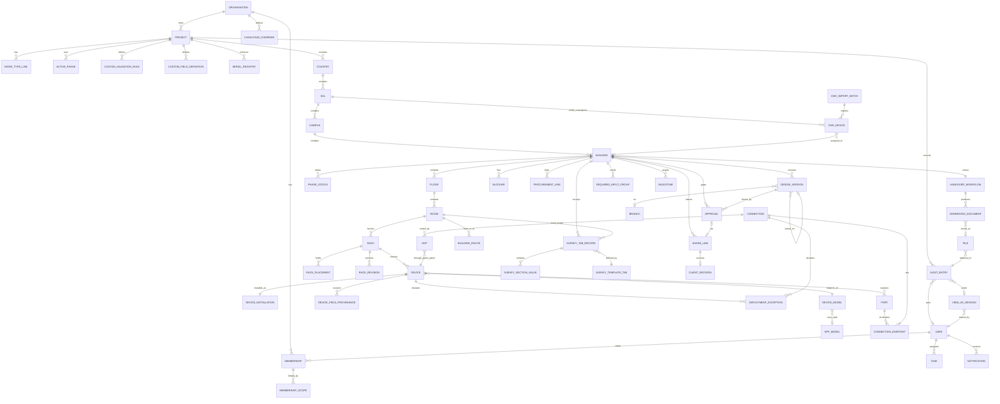

# Rackium data model

Written for: the engineers who will design and build the real backend schema. This is the contract the backend must satisfy. It is derived from the prototype's mock store (`client/src/mock/`, `client/src/api/`, `client/src/lib/`) and the v2.3 brief (`docs/RACKIUM-BRIEF-v2.3.md`), plus the client audit additions. No backend code or schema is defined here.

## 0. Conventions and source legend

**Source tags** on every entity and field group:

- **[M]** exists in the prototype's mock store. The shape is taken from the code. Gaps against the brief are called out.
- **[B]** specified in the brief only. No mock store yet.
- **[C]** client audit addition. Not in the brief and no UI or mock yet. Required by the contract anyway.

**Identifiers.** Opaque, non-guessable IDs (UUIDv7 or ULID) for every stored entity. Human codes (`TR-EG-01`, `R01`, `E-DE-ERL-C01-B001-EG-001`, `PP-01`, cable IDs) are separate attributes, never primary keys. The prototype uses readable IDs such as `b001-eg`, `dev-fusion` and `conn-border-edge-1`. These are seed conventions only and must not leak into the backend.

**Timestamps.** `timestamptz` in UTC, ISO-8601 on the wire. Date-only values (`due_date`, `eol_date`, `dguv_date`) are `date`.

**Enums.** `snake_case` strings with a database-level check or enum type. Labels are UI concerns.

**Money.** Integer minor units (cents) plus an ISO-4217 `currency` code on the row. The prototype stores decimal numbers (`unitPrice: 8500`, `EUR` constant) and this must change. Default currency EUR per organisation (§5.6).

**Required/optional.** R = required, O = optional, C = computed and never stored (see §7).

---

## 1. Organisation scoping and tenancy

Brief §4.1: every record belongs to exactly one organisation, and no API call may return another organisation's data.

| Scope class | Entities | How scope is carried |
|---|---|---|
| **Carries `organisation_id` and `project_id` directly** | `project`, `audit_entry`, `user_membership`, `invitation`, `task`, `notification`, `approval`, `blocker`, `share_link`, `generated_document`, `file`, `custom_validation_rule`, `custom_field_definition`, `project_settings`, `work_type`, `active_phase`, `phase_target`, `milestone`, `design_version`, `required_input_group`, `procurement_line`, `handover_workflow`, `survey_tab_record`, `cmo_import_batch`, `cmo_device` | Direct columns, with a composite index `(organisation_id, project_id, …)`. Every query filters on both. |
| **Inherit via a parent** | `country`, `sal`, `campus`, `building`, `floor`, `room`, `rack`, `device`, `patch_panel`, `port`, `connection`, `hop`, `survey_rack_placement`, `deployment_exception`, `cmdb_change_log`, `device_field_provenance` | Chain of foreign keys up to `project`. The backend should **denormalise `project_id` onto every row** anyway, so that row-level security and tenant-scoped indexes do not require joins. |
| **Global (platform-owned)** | `device_model_seed`, `sfp_seed`, `survey_template_seed`, `handover_document_type`, `resource_task_seed` | No organisation column. Read-only to customers. Organisation or project layers sit on top (§5.6). |
| **Organisation-level, shared across projects** | `organisation`, `user`, `org_settings`, org-layer catalogue | Keyed by `organisation_id` only. |

**[M] Current prototype gap.** Mock floors, rooms, racks, devices and connections carry no `organisationId` or `projectId`. Organisation scope is implicit in the single hard-coded organisation (`hierarchy.js`). Custom survey fields are keyed by tab name only (`surveyFormsDesign.js` `customFieldsByTab`). Both must be scoped in the backend.

---

## 2. Entities

Each entity lists its purpose, fields, relationships and uniqueness. A field table says *name · type · R/O/C · allowed values or format · default · brief section · source*.

### 2.1 Hierarchy

**Organisation** [M `hierarchy.js` `organisation`] (brief §4.1)

*Purpose:* tenancy root. Every other record traces back here.

| Field | Type | R/O/C | Allowed / format | Default | § | Src |
|---|---|---|---|---|---|---|
| id | uuid | R | | generated | §4.1 | M |
| name | text | R | | | §4.1 | M |
| default_currency | char(3) | R | ISO-4217 | `EUR` | §5.6 | B |
| default_cord_length_m | numeric | R | >0 | `2` | §6.7 | B |
| gdpr_deletion_requested_at | timestamptz | O | | null | §6.11 | B |
| deleted_at | timestamptz | O | soft delete; purge within 30 days (§6.11) | null | §6.11 | B |

**Project** [M `hierarchy.js` `project`; fields marked C are not yet in mock] (brief §4.3 "Create projects": Org Admin or PM)

| Field | Type | R/O/C | Allowed / format | Default | § | Src |
|---|---|---|---|---|---|---|
| id | uuid | R | | | | M |
| organisation_id | uuid | R | FK | | §4.1 | M |
| name | text | R | | `LANspire` in seed | | M |
| code | text | O | | | | C |
| status | enum | R | `active` / `archived` | `active` | | C |
| work_types | text[] | O | values from the predefined list in §2.9; custom types stored in `work_type` | `[]` | | C |
| active_phases | ordered list of phase ids | R | non-empty ordered subset of the 9 phase ids (§2.9) | all 9 in order | | C |
| created_by | uuid | R | FK user | | | B |
| created_at | timestamptz | R | | now() | | B |

**Country** [M `hierarchy.js` `country`] (brief §4.1 "PM creates Country → Building")
- id · project_id (FK, R) · code (text R, e.g. `DE`) · name (text R, e.g. `Germany`).
- Unique `(project_id, code)`.

**SAL** [M `hierarchy.js` `sal`] (brief §4.1)
- id · country_id (FK, R) · code (text R, e.g. `ERL`).
- Unique `(country_id, code)`.
- SAL-level devices (the Unassigned CMO list) hang off this node, not a building (§5.1).

**Campus** [M `hierarchy.js` `campus`] (brief §4.1)
- id · sal_id (FK, R) · code (text R, e.g. `C01`).
- Unique `(sal_id, code)`.

**Building** [M `hierarchy.js` `buildings[]`] (brief §4.1, §7.3)

| Field | Type | R/O/C | Allowed / format | Default | § | Src |
|---|---|---|---|---|---|---|
| id | uuid | R | | | | M |
| campus_id | uuid | R | FK | | | M |
| project_id | uuid | R | denormalised FK | | | B |
| code | text | R | e.g. `B001`; unique per campus | | §4.1 | M |
| name | text | R | | | | M |
| site_size | enum | R | `S` (collapsed core, no Distribution tier) plus other sizes, **values not defined in the brief** (open point) | `S` | §5.3 | M |
| next_milestone | — | C | derived from `milestone` (§2.13). The prototype stores a free-text string. | | | M |
| last_sync_at | timestamptz | C | max `audit_entry.occurred_at` for the building | | §7.3 | M (static) |

**Wing** — optional level between Building and Floor (§4.1). **[B] not modelled in the mock.** Schema should include an optional `wing` table or nullable `wing_id` on floor.

**Floor** [M `b001-site.js` `floors`] (brief §4.1, §6.6)
- id · building_id (FK, R) · wing_id (FK, O, §4.1) · token (text R; allowed `FU1`, `EG`, `1.OG`, `2.OG`, `3.OG` by default, configurable per project §6.6) · name (text R, e.g. `Ground floor (EG)`) · order (int R, ≥0).
- Unique `(building_id, token)` and `(building_id, order)`.
- The hostname form strips dots and spaces from the token (`1.OG` → `1OG`). Stored once, see §8.

**Room** [M `b001-site.js` `rooms`, `roomSurveyMeta.js`] (brief §5.2)

| Field | Type | R/O/C | Allowed / format | Default | § | Src |
|---|---|---|---|---|---|---|
| id | uuid | R | | | | M |
| floor_id | uuid | R | FK | | | M |
| code | text | R | e.g. `TR-EG-01`, `UG1705`; unique per building | | §5.2 | M |
| name | text | O | | = code | | M |
| is_main_room | bool | R | | false | | M (`isMainRoom`) |
| access | enum | R | `verified` / `not_verified` | `not_verified` | §5.2 | M |
| power | enum | R | `available` / `unknown` | `unknown` | §5.2 | M |
| environment | enum | R | `verified` / `to_verify` / `unknown` | `unknown` | §5.2 | M |
| photo_count | int | C | count of attached `file` rows (§9) | 0 | | M (stored counter; should be computed) |

**Rack** [M `b001-site.js` `racks`, `rackSurveyMeta.js`] (brief §4.1, §4.3 rack placement rules)

| Field | Type | R/O/C | Allowed / format | Default | § | Src |
|---|---|---|---|---|---|---|
| id | uuid | R | | | | M |
| room_id | uuid | R | FK | | | M |
| code | text | R | e.g. `R01`; unique per room | | §5.2 | M |
| height_u | int | R | one of 12, 24, 42, 45, 48, or a custom height defined by Org Admin (e.g. 23) | 42 | §4.1 | M |
| type | enum | O | `floor_standing` (mock: `Floor-standing`) | | §5.2 | M |
| standard | text | O | e.g. `19-inch` | `19-inch` | | M |
| external_depth_mm · usable_depth_mm · rail_distance_mm | int | O | >0 | | | M |
| condition | enum | O | `good` (further values open) | | | M |
| cage_nut_type | text | O | e.g. `M6` | | | M |
| available_cage_nut_sets | int | O | ≥0 | | | M |
| mounting_rails | text | O | e.g. `Front & rear` | | | M |
| redundant_power | enum | O | `available` / `not_available` | | | M |
| earthing_verified | bool | O | | | | M |
| main_cable_entry · pathway · secondary_entry | text | O | | | | M |
| vertical_managers · horizontal_managers | int | O | ≥0 | | | M |
| clearance front/rear/left/right | enum + mm | O | `accessible` / `not_accessible`; `front_clearance_mm`, `rear_clearance_mm` | | | M |
| ru_state (per RU) | — | | see `rack_ru` in §2.2. Not a column on rack. | | §4.1 | B |

**Rack power outlets** [M `rackSurveyMeta.mountingPower.pduA/pduB`] — `rack_pdu` (id · rack_id · label `A`/`B` · total_sockets int · free_sockets int · *free_sockets is entered on site*, but Comms Rooms Summary takes it as a calculated input, §5.2).

**Rack RU occupancy** — computed (§7). Stored rows only for explicit states that cannot be derived: `rack_ru_reservation` (rack_id · ru int · state `reserved` | `blocked` · set_by · set_at · reason). Brief §4.1: `reserved` is set by Architect and released by Architect; `blocked` is set by PM or Org Admin and the Architect cannot override it. **[B] not in the mock.**

### 2.2 Devices, ports and patching

**Device** [M `b001-site.js` `devices`, `networkStore.js`] (brief §4.1, §6.6, §5.7, §5.8)

| Field | Type | R/O/C | Allowed / format | Default | § | Src |
|---|---|---|---|---|---|---|
| id | uuid | R | | | | M |
| project_id | uuid | R | denormalised | | | B |
| hostname | text | R | `{role}-{country}-{sal}-{campus}-{building}-{floorToken}-{seq:03}`, unique project-wide | generated (§8) | §6.6 | M |
| role | enum | R | `fusion`, `border`, `distribution`, `edge`, `ap`, `wan-circuit` (used in mock, see §10). Brief D36 also mentions probe devices. | | §4.1, §6.5 | M |
| model | text | R | must exist in device catalogue (§2.8) | | §6.5 | M |
| category | enum | R | `network_device` \| `patch_panel` \| `accessory` \| `pdu` \| `cable_management` \| `wan_circuit` \| `reserved_space` (mock mixes patch panels in a separate array) | `network_device` | §6.5, §7.5 | M (partial) |
| rack_id | uuid | O | FK. Null if not racked (e.g. Ceiling APs, §6.5 `rackMounted: false`). | | §4.1 | M |
| ru | int | O | ≥1; null for ceiling/0U items | | §4.1 | M |
| height_u | int | R | ≥0; 0 for 0U vertical PDUs (§4.1) | 1 | §4.1 | M |
| face | enum | R when racked | `front` / `rear`. A `full_depth` item occupies both (§4.1). | `front` | §4.1 | M |
| full_depth | bool | R | | false | §4.1 | B |
| rail_side | enum | O | `left` / `right`, only for 0U items | | §4.1 | M (survey placements) |
| status | enum | R | see §6.2 (device status) | `planned` | §4.4 | M |
| location_snapshot | — | C | room/rack/floor resolved through FKs, never stored | | | M (`placeOf`) |
| lifecycle | — | O | see §2.9 device lifecycle | | | C |
| installation | — | O | see installation sub-record below | | §5.7 | M |

**Device installation sub-record** [M `deploymentDesign.js` `installation` object] — 1:1 with device, written by Deployment (§5.7), never overwrites design fields.

| Field | Type | R/O/C | Allowed / format | § | Src |
|---|---|---|---|---|---|
| serial | text | O | unique project-wide case-insensitive (§2.3) | §5.1 | M |
| mac | text | O | 6 octets hex, `:` or `-` separators, unique project-wide | §5.1 | M |
| serial_validation | enum | C | `validated` / `not_in_cmo` / `duplicate` — **stored in mock, must be computed** (§10) | §5.1 | M |
| confirmed_ru | int | O | | §5.7 | M |
| pdu_outlet | text | O | | §6.7 | M |
| latitude · longitude · altitude | numeric | O | WGS84 | | M |
| technician_user_id | uuid | O | FK user (mock stores a name string) | | M |
| installed_at | timestamptz | O | | | M |
| checklist | jsonb | R | keys `rack_ru`, `labelled`, `power`, `patched`, `tested`, `dguv`; booleans. Derived progress is C. | §5.7 | M |
| dguv_last_inspection_date | date | O | | §6.9 | M (`dguvDate`) |
| evidence_count | int | C | count of `file` rows with `category = evidence` | §5.7 | M (stored counter) |

**Port** [M implicit: port IDs are strings per device, `lib/portMap.js`] — **not a stored entity in the mock.** The backend should store it.

| Field | Type | R/O/C | Allowed / format | § | Src |
|---|---|---|---|---|---|
| device_id | uuid | R | FK | | M |
| port_id | text | R | e.g. `Te1/1/1`, `Gi1/0/48`, `01` for a patch panel. Unique per device. | §5.8 | M |
| kind | enum | R | `copper` / `sfp` / `uplink_module` | §5.8 | M (`portKind`) |
| speed | enum | O | `1G` / `10G` / `40G` | §5.8 | M |
| is_access | bool | R | access ports never exceed the device's real port count (§5.8) | §5.8 | M |
| preoccupied | bool | O | ports used by legacy cabling outside project scope (mock: `preOccupiedPorts`, PP-09) | §6.8 | M |

**Patch panel** [M `b001-site.js` `patchPanels`] — **modelled as a Device** in the backend with `category = patch_panel`. The prototype keeps a separate array, and this is a mismatch (§10).
- Fields: code (text R, `PP-CORE-CU`, `PP-01`), `type` (`copper` / `fibre`, R), `ports` (int R, 24 in seed), plus the device fields above.

**Cable and connection** [M `networkStore.js` `connections`] (brief §6.2)

| Field | Type | R/O/C | Allowed / format | Default | § | Src |
|---|---|---|---|---|---|---|
| id | uuid | R | | | | M |
| project_id | uuid | R | denormalised | | | B |
| source_device_id · source_port | uuid · text | R | FK device, port | | §6.2 | M (`source.deviceId/port`) |
| dest_device_id · dest_port | uuid · text | R | FK device, port | | §6.2 | M |
| media | enum | R | `os2`, `om4`, `cat6a`, `stack`, `dac`. Brief §7.1 also lists `power` and `planned` (display categories, not connection media). | | §6.2, §7.1 | M |
| speed | enum | R | `1G` / `10G` / `40G` | | §6.4 | M |
| source_sfp_code · dest_sfp_code | text | O | FK `sfp_catalog.code`, must match media and speed (§6.4). Null for `cat6a` and `dac`. | | §6.4 | M |
| cable_id | text | O until LLD approved; mandatory after | 1–32 chars; unique project-wide, case-insensitive, shared with hop segment IDs (§6.1) | | §6.1 | M |
| lengths.suggested_m | numeric | C (stored snapshot in mock) | >0 | | §6.3 | M |
| lengths.engineer_selected_m | numeric | O | >0; null = use suggested | | §6.3 | M |
| lengths.installed_m | numeric | O | >0, Deployment only | | §6.3 | M |
| status | enum | R | see §6.3 (connection status) | `designed` | §4.4 | M |
| test_result | enum | O | `pass` / `fail` | | §6.2 | M |
| evidence_count | int | C | | | §6.2 | M |

**Connection hop** [M `hops: []` always empty in seed; brief §6.2] — ordered list per connection.

| Field | Type | R/O/C | Allowed / format | § | Src |
|---|---|---|---|---|---|
| connection_id | uuid | R | FK | §6.2 | B |
| seq | int | R | 1..n, unique `(connection_id, seq)` | §6.2 | B |
| patch_panel_id | uuid | R | FK device | §6.2 | B |
| in_port · out_port | text | R | FK port on that patch panel | §6.2 | B |
| room_id · rack_id · ru | uuid · uuid · int | R | location (§6.2) | §6.2 | B |
| segment_cable_id | text | O | same namespace and uniqueness as `connection.cable_id` (§6.1) | §6.1 | B |

**Building connection (route between rooms)** [M `siteStructure.js` `connections`] — **distinct from a device connection.** See §10 on naming.

| Field | Type | R/O/C | Allowed / format | § | Src |
|---|---|---|---|---|---|
| id · from_room_id · to_room_id | uuid | R | FK room (different buildings allowed, §5.2) | §5.2 | M |
| route_status | enum | R | `surveyed` / `estimated` | §5.2 | M |
| distance_m | numeric | O | >0 | §6.3 | M |
| evidence_count | int | C | | | M |

**Cable ID allocation** — see §3 (atomic operation).

### 2.3 CMO and serial records

**CMO import batch** [M `cmoDesign.js` `lastImportAt`] — `cmo_import_batch` (id · project_id · uploaded_by · uploaded_at · source_filename · row_count · status). Brief §5.1: CMO is imported from Excel and scoped per building.

**CMO device** [M `cmoDesign.js` `cmoDevices`] (brief §5.1)

| Field | Type | R/O/C | Allowed / format | Default | § | Src |
|---|---|---|---|---|---|---|
| id | uuid | R | | | | M |
| import_batch_id | uuid | R | FK | | §5.1 | B |
| hostname | text | O | | | §6.6 | M |
| model | text | O | matched to device catalogue when possible | | | M |
| serial | text | R | unique project-wide, case-insensitive (§2.3) | | §5.1 | M |
| mac | text | O | normalised format | | §5.1 | M |
| building_id | uuid | O | Null = Unassigned at SAL level (§5.1) | null | §5.1 | M |
| room_id · rack_id | uuid | O | resolved by room/rack code match | null | §5.1 | M |
| room_code · rack_code | text | O | as imported (kept for display, §10) | | | M |
| ru | int | O | | | | M |
| assigned_by · assigned_at | uuid · timestamptz | O | set when the PM assigns an unassigned device | | §5.1 | B |

*Each unassigned CMO device counts as an open blocker (§5.1). This is computed, not stored (§7).*

**Serial registry** [M three places: `cmo.js` `projectSerials`, `cmoDesign` `cmoDevices.serial`, `networkStore` `installation.serial`] — **target: one table**, not three.

| Field | Type | R/O/C | Notes | § | Src |
|---|---|---|---|---|---|
| project_id | uuid | R | | | |
| serial_normalised | text | R | lowercased, trimmed; unique `(project_id, serial_normalised)` | §5.1 | M |
| owner_type | enum | R | `cmo_device` \| `device` | | |
| owner_id | uuid | R | | | |

**Survey record** — the tab-level workflow record is in §2.4.

### 2.4 Physical site survey records

**Survey tab definition** [M `docs/survey-fields.json`, read by `lib/surveyFormModel.js`] — reference data, versioned. **18 tabs.** Target: a `survey_template` in organisation settings (§2.9). Fields per tab are `key`, `label`, `requirement` (`must` / `good_to_have` / `must_if_allowed` / `unspecified`), `type` (`text`, `number`, `number_m`, `yes_no`, `serial`, `mac`, `ip`, `email`, `phone`, `gps`, `photo`, `photo_multi`, `file`, `rack_elevation`), optional `hint` (option list), optional `prefill` (`prefilled` / `prefilled_validated`), section `layout` (`key_value` / `table` / `item_list` / `gallery`).

**Survey tab record** [M `surveyFormsDesign.js` `recordsByKey`, `statusByKey`] (brief §5.2, Step 10)

| Field | Type | R/O/C | Allowed / format | Default | § | Src |
|---|---|---|---|---|---|---|
| id | uuid | R | | | | M (key string) |
| project_id · building_id | uuid | R | | | | M |
| room_id | uuid | O | Required when `tab.scope = room`. Null for building-scope tabs. | null | §5.2 | M |
| tab | enum | R | one of the 18 tab names | | §5.2 | M |
| status | enum | R | see §6.4 | `draft` | §5.2 | M |
| submitted_at · submitted_by | timestamptz · uuid | O | `submitted_by` is a user ID (mock stores a role string) | | §5.2 | M (partly) |
| verified_at · verified_by | timestamptz · uuid | O | | | §5.2 | M |
| rejected_at · reject_reason | timestamptz · text | O | `reject_reason` required when rejected | | §5.2 | M |
| imported_at | timestamptz | O | set on HLD import | | §5.2 | B |
| last_modified_at | timestamptz | R | set on every edit; drives offline conflict detection (§3) | now() | §6.10 | M |
| version | int | R | optimistic concurrency token, incremented on every write | 1 | §6.10 | B |

**Survey section data** [M `sections: [...]` index-aligned with tab definition] — `survey_section_value` rows keyed by `(survey_tab_record_id, section_index)`:

- `key_value` layout: map of field key → value. For `prefilled_validated` fields, a companion boolean `<key>__confirmed` with `confirmed_by` and `confirmed_at` (the "Validated on site" tick).
- `table` layout: rows. Each row has a stable `row_id` and field → value, plus `__confirmed` companions. **Empty table is complete** (§6.4).
- `item_list` layout: `{ row_field_key: { column: value } }`.
- `gallery` layout: photo references (§9).
- `rack_elevation` / Rack Layout section: one instance per real rack, `rack_id` plus field values. Reconciled on read from the rack list (§2.1).

**Survey custom field** [M `customFieldsByTab`, keyed by tab name only] (brief §5.2, Step 10)

| Field | Type | R/O/C | Notes | § | Src |
|---|---|---|---|---|---|
| id | uuid | R | | | |
| organisation_id · project_id | uuid | R | **mock keys by tab name only; scope is required** | §4.3 | M/B |
| tab | enum | R | | | M |
| key | text | R | `custom_<id>`, never editable after creation | | M |
| label | text | R | renameable only if it is custom, never a core field | | M |
| type | enum | R | same vocabulary as §2.4 | | M |
| requirement | — | R | always `unspecified`. Custom fields are never required and never calculated (brief). | | M |

**Core fields cannot be removed or renamed** (Step 10 spec). This is a constraint on the template, not a column.

**Room survey meta** — see Room in §2.1.

**Rack survey placement** [M `survey.js` `placementsByRack`] — the Rack Survey's own capture of what sits in a rack.

| Field | Type | R/O/C | Notes | § | Src |
|---|---|---|---|---|---|
| id | uuid or text | R | references `device.id` for real devices, or a survey-only id for extras (cable managers, reserved RU, PDUs, see DEMO_EXTRAS) | §7.5 | M |
| rack_id | uuid | R | FK | | M |
| ru · height_u · face · full_depth · mounting · rail_side | — | | same meanings as Device | §4.1 | M |
| kind | enum | R | `device` / `reserved` / `blocked` | §4.1 | M |
| category · label · sublabel | text | O | display | | M |
| revision | — | | see Rack revision below | §6.10 | M |

*Placements duplicate devices (§10).* The target must decide whether the Rack Survey writes to `device` directly or keeps a separate capture (open point).

**Rack revision** [M two counters: `survey.js` `revisionByRack` and `lld.js` `revisionByRack`] — **target: one** `rack_revision` per rack (id · rack_id · revision int · saved_by · saved_at · unsaved_changes int). See §10.

### 2.5 Phases and status

**Phase** [M `phases.js` `PHASES`] — a fixed catalogue of 9 phases in the prototype. **Target: the project chooses an ordered active subset** (§2.9 `active_phase`). The phase catalogue itself is global:

| id | name | stepper label |
|---|---|---|
| `cmo` | CMO Inventory Validation | CMO |
| `survey` | Physical Site Survey | Survey |
| `hld` | HLD | HLD |
| `lld` | LLD | LLD |
| `solution-package` | Solution Package | Sol. Package |
| `bom` | BOM | BOM |
| `deployment` | Deployment & Installation | Deployment |
| `cmdb` | CMDB | CMDB |
| `handover` | Handover | Handover |

Naming rule (brief §7.2): "Deployment & Installation" in full everywhere except the compact stepper chip.

**Phase status record** [M `phaseStatusStore.js` `overrides`; static fallback in `hierarchy.js` `buildings[].phases`] (brief §4.4, §7.3)

| Field | Type | R/O/C | Allowed / format | Default | Src |
|---|---|---|---|---|---|
| building_id · phase_id | uuid · enum | R | unique pair | | M |
| status | enum | R | §6.1 phase status | `not_started` | M |
| sub_label | text | O | `Draft` on BOM before Solution Package approval | null | M |
| updated_at · updated_by | timestamptz · uuid | R | target adds `updated_by`; mock has no actor | | M/B |
| source | enum | R | `stored` (approval phases) or `derived` (survey, deployment, cmdb, cmo) | | C |

*Approval-driven phases (HLD, LLD, Solution Package, BOM, Handover) store status. Derived phases (CMO, Survey, Deployment, CMDB) recompute from their underlying records and must not be stored (§7). The prototype pushes derived values into `overrides` on every read. See §10.*

### 2.6 Approvals, blockers and open items

**Approval** [B brief §4.3 "Approve HLD / LLD / Solution Package internally", §5.5 client approval; C generic record] — one record per phase gate. **Mock has none** (see §10).

| Field | Type | R/O/C | Allowed / format | Default | § | Src |
|---|---|---|---|---|---|---|
| id | uuid | R | | | | C |
| project_id · building_id | uuid | R | | | | C |
| phase_id | enum | R | `hld`, `lld`, `solution-package`, `bom`, `deployment`, `handover` | | §4.4 | C |
| gate | enum | R | `hld_internal`, `lld_internal`, `sp_internal`, `sp_client`, `bom_pm`, `deployment_acceptance`, `handover_client` | | §4.3, §5.5 | C |
| design_version_id | uuid | R | FK `design_version` (§2.11). The approval attaches to a frozen version, not a moving target. | | §6.10 | C |
| submitted_by · submitted_at | uuid · timestamptz | R | role must be Architect for HLD/LLD/SP internal submit | | §4.3 | B |
| reviewer_user_id | uuid | O | PM or Reviewer for internal gates. Null for client gates. | | §4.3 | B |
| client_link_id | uuid | O | FK `share_link`, for client gates | | §5.5 | B |
| decision | enum | O | `approved` / `changes_requested` / `rejected` | | §4.4 | C |
| decided_by · decided_at | uuid/text · timestamptz | O | client decisions record name and role since the client may not be a user (§5.5) | | §5.5 | B |
| comments | text | O | | | §5.5 | B |
| acceptance_terms_accepted | bool | O | required for client decisions | | §5.5 | B |
| signature_file_id | uuid | O | optional drawn signature (§5.5) | | §5.5 | B |

**Blocker** [M `hierarchy.js` `openItems` (type `blocker`) plus computed blockers in `buildings.js`; C fields] (brief §4.4 "Blocked" status, §5.1 unassigned devices)

| Field | Type | R/O/C | Allowed / format | Default | Src |
|---|---|---|---|---|---|
| id | uuid | R | | | M (`b001-blk-1`) |
| project_id · building_id | uuid | R | | | C |
| phase_id | enum | R | | | M |
| description | text | R | | | M (`title` + `detail`) |
| related_object_type · related_object_id | enum · uuid | O | device, connection, rack, bom_line, survey_tab_record, … | | M (partial) |
| raised_at · raised_by | timestamptz · uuid | R | | | C |
| owner_user_id | uuid | O | | | C |
| priority | enum | R | `low` / `medium` / `high` / `critical` | `medium` | C |
| status | enum | R | `open` / `in_progress` / `resolved` | `open` | C |
| resolved_at · resolved_by | timestamptz · uuid | O | | | C |

*In the mock, the dashboard's open blocker count is the static `openItems` blockers plus the unassigned CMO device count (`buildings.js`: `countByType(openItems, 'blocker') + cmoKpis.unassigned`). The seed's RU-conflict and unpriced-line blockers are static items, not calculated. The target should calculate them (RU conflicts from placements, unpriced BOM lines from the catalogue) and store only human-raised blockers. Unassigned CMO devices are calculated, not blocker rows. See §7.*

**Open item** — the prototype's `openItems` also contains `type: 'approval'`. These are approval requests shown on the dashboard, and must map to an `approval` row.

### 2.7 Solution Package and required inputs

**Required input group** [M `requiredInputsStore.js` `REQUIRED_INPUT_GROUPS`] (brief §5.5, 12 groups)

| Field | Type | R/O/C | Allowed / format | Src |
|---|---|---|---|---|
| id | enum | R | `addressing`, `routing`, `catalyst-center`, `central-services`, `security`, `wireless`, `software`, `monitoring`, `migration`, `testing`, `commercial`, `governance` | M |
| n | int | R | 1–12 | M |
| name | text | R | | M |
| project_id · building_id | uuid | R | | C |
| owner_user_id | uuid | O | | M (`meta.owner`) |
| due_date | date | O | | M (`meta.dueDate`) |
| status | enum | C | `not_started` / `in_progress` / `complete` — derived from entries | M |

**Addressing entry** (group 1 only) [M `addressing`]: id · group_id · label (text) · vlan_id (int 1–4094) · cidr (text) · gateway (ip). Overlap and duplicate rules live in `lib/networkAddressingValidation.js`.

**Key/value pair** (groups 2–12) [M `kv`]: id · group_id · key (text) · value (text). Pairs are complete only when key and value are both filled.

**Solution Package section** — **computed, not stored** (18 sections, §7). Only the acceptance of a validation warning is stored:

**Accepted validation warning** [M `solutionPackageDesign.js` `warningsByBuilding`]: id · project_id · building_id · area_id (text) · text · accepted_by_user_id · accepted_by_role · accepted_at. Mock stores accepted_by as a display string.

**Share link** [M `shareLink.js` `links`; C fields] (brief §5.5 "PM generates a link with a password and an expiry, default 14 days, 1–30 allowed")

| Field | Type | R/O/C | Allowed / format | Default | Src |
|---|---|---|---|---|---|
| id · token | uuid · text | R | token ≥128 bits random, URL-safe. Mock: 16 base-36 characters (~82 bits — **too short for the target**, §10). | | M |
| project_id · building_id | uuid | R | | | M |
| kind | enum | R | `solution-package` / `handover` | `solution-package` | M |
| password_hash | text | R | **bcrypt or argon2**. Mock stores plaintext (§10). | | M (`password`) |
| expires_at | timestamptz | R | 1–30 days from creation | creation + 14 d | M |
| created_by | uuid | R | role PM only (§4.3) | | M (no actor) |
| revoked_at | timestamptz | O | | | M (`revoked` bool) |
| view_count · last_viewed_at | int · timestamptz | C | | | C |

**Client decision** [M `shareLink.js` `decisions`]: id · share_link_id · decision (`approved` / `changes_requested` / `rejected`) · name · role · comments · accepted_at · has_signature · signature_file_id. Client identity is name and role, not a user (§5.5).

### 2.8 BOM, catalogue and cost

**Device catalogue — seeded** [M `deviceCatalogue.js` `DEVICE_CATALOGUE`] (brief §6.5). Global. Keyed by `model`. Brief §6.5: 20–30 Cisco Catalyst models supplied by Technonex.

| Field | Type | R/O/C | Allowed / format | Default | § | Src |
|---|---|---|---|---|---|---|
| model | text | R | unique, exact string used on devices | | §6.5 | M |
| vendor | text | R | | `Cisco` | §6.5 | M |
| category | enum | R | `passive` · `active_networking` (`switch`, `router`, `firewall`, `ap`, `wlc`) · `server` · `infrastructure` (`ups`, `pdu`, `sensor`) · `external` (`wan_sp_connection`, `remote_site`) | | C |
| rack_mounted | bool | R | | | M |
| height_u | int | R | | | C (not in mock catalogue; device record carries height) |
| psu_count | int | R | ≥0 (0 = PoE-only; no DGUV obligation, §6.9) | 0 | M |
| power_inlet_type | enum | O | `C14`, `C20`, … or null | | M |
| needs_uplink_module | bool | R | | false | M |
| servon_available · servon_product_code | bool · text | O | Manual flag, no automatic sync (D35) | false | M (flag) / B (code) |
| unit_price_minor | bigint | R | minor units | | M (`unitPrice`, decimal) |
| currency | char(3) | R | ISO-4217 | `EUR` | M (constant) |
| eos_date · eol_date | date | O | | | C |
| layer | enum | R | `seeded` → `servon` → `organisation` → `project` (see §5.6) | | C |

**SFP / optic** [M `sfpCatalog.js` `SFP_CATALOG`] (brief §6.4, §6.5)

| Field | Type | R/O/C | Allowed / format | Src |
|---|---|---|---|---|
| code | text | R | unique, e.g. `SFP-10G-LR` | M |
| media | enum | R | `os2`, `om4`, `dac`, `stack` | M |
| speed | enum | R | `1G`, `10G`, `40G` | M |
| reach_m | numeric | R | >0 (drives the distance-vs-optic check, §6.4) | M |
| unit_price_minor · currency | bigint · char(3) | R | | M |
| layer | enum | R | as above | C |

**Stock cable length** [M `lib/cableLength.js`] (brief §6.3, D27): per-media table, configurable by Org Admin. Target: `stock_cable_length` (org_id · media · length_m numeric · unit_price_per_m · currency).

**Cable and device price overrides** (project layer, §5.6): `catalogue_override` (project_id · layer `organisation` | `project` · catalogue_ref (model or sfp code) · unit_price_minor · currency · set_by · set_at · reason). Prices entered by PM or Org Admin (D19).

**Procurement line** [M `bomDesign.js` `procurementOverrides`; computed lines in `bomModel.js`] (brief §5.6, §5.7)

BOM **lines are computed** from HLD and LLD on every read (§7). Only per-line procurement data is stored:

| Field | Type | R/O/C | Allowed / format | Default | § | Src |
|---|---|---|---|---|---|---|
| project_id · building_id | uuid | R | | | | C |
| line_key | text | R | stable key. Mock forms: `device:{role}`, `optic:{sfp code}`, `cable:{media}:{length}`, `power:psu`, `power:cord`, `power:nm`, `power:cage-nuts`. | | M |
| vendor | text | O | brief: "vendor field", no partial packages | | M |
| procurement_status | enum | R | `not_ordered` / `ordered` / `shipped` / `delivered` (§6.2 procurement transitions) | `not_ordered` | M |
| po_number | text | O | | | M |
| expected_delivery · actual_delivery | date | O | | | M |
| notes | text | O | | | M |
| updated_by · updated_at | uuid · timestamptz | R | | | C |

*Granularity is open: `device:{role}` aggregates all devices of that role in the building into one line (§10).*

**Project settings — commercial** [M `projectSettings.js` `margin`; C fields]: `margin_percent` (numeric, default 15, PM-editable, §5.6) · `currency` (default org currency) · `price_visibility` (per export, D20).

### 2.9 Project settings, templates and configuration (client audit additions)

These are required by the audit. The prototype has partial coverage in `projectSettings.js` (margin, resource minutes) and in `powerStandards.js` (customer power-cord standard). Everything else is target.

**Project settings** [M partial; C rest]

- **General:** name, code, description, timezone, units (metric), currency, default cord length (2 m, §6.7).
- **Hierarchy:** whether a Wing level is used (§4.1), floor token scheme (§6.6), building site-size options.
- **Device roles:** role codes F / B / D / E / A (§6.6), plus any project-specific role codes. Role codes drive hostname generation.
- **Connection types:** media and speed allowed per project (§6.2).
- **Naming conventions:** hostname pattern, floor token map, sequence padding (3 digits in seed). Changes apply to new records; existing hostnames are not rewritten (§8).
- **Survey templates:** choice of template version per project (`survey_template_version_id`).
- **Validation rules:** enable or disable built-in rules and assign severity (see custom rules below).
- **Members and permissions:** membership table (below).
- **Templates:** document templates for generated documents (§2.12).
- **Resource standards:** minutes per task (`resource_task_setting`: project_id · task_id · minutes int). Seed in `billOfResources.js` `RESOURCE_TASKS` with `defaultMinutes`.

**Work type** [C] — project multi-select from a predefined list, plus custom types.
- `work_type` rows: id · organisation_id · name · is_predefined bool · created_by. The predefined list is **not in the audit or the brief** and must be supplied by Technonex (open point).
- `project_work_type`: project_id · work_type_id (unique pair).

**Active phase** [C]: `project_active_phase`: project_id · phase_id · position int (unique `(project_id, position)` and `(project_id, phase_id)`). A non-empty subset of the 9 phases, in order. Phase gating, progress % and the sidebar use this list, never the fixed nine. Rule for which active phase blocks which is open (§10).

**Phase target** [C]: project_id · building_id · phase_id · target_date date · sla_days int (≥1) · set_by · set_at. Brief §4.3: Org Admin and PM "set phase targets, allow parallel phases".

**Milestone** [C]: id · building_id · name · due_date date · completed_at timestamptz · depends_on_phase_id enum. The dashboard's "next milestone" is derived as the earliest uncompleted milestone (§7).

**Custom validation rule** [C]: id · organisation_id · project_id (null = organisation-wide) · name · definition jsonb (expression over typed fields; DSL to be specified) · entity_type (`connection`, `device`, `rack`, `room`, `survey_tab_record`) · severity (`info` / `warning` / `error` / `blocking`) · scope (`project` / `building`) · enabled bool (default true) · created_by · created_at. Built-in rules remain code, not rows (`lib/validation.js`, `lib/siteValidation.js`).

**Custom field definition** — see the survey custom field in §2.4.

### 2.10 Users, membership, invitations and View As (client audit additions)

**User** [C] (brief §4.3 roles)
- id · email (unique, lower-cased) · name · status (`invited` / `active` / `disabled`) · last_login_at · mfa_enabled bool (mandatory for Org Admin, PM, Architect, brief §8.1) · created_at.
- No passwords or secrets in this table. Authentication is a separate concern (§8.1).

**Membership** [C] (brief §4.3, §2.6): membership_id · user_id · organisation_id · role · created_at · revoked_at.
- `role` enum: `org_admin`, `pm`, `architect`, `reviewer`, `field_engineer`, `viewer`, plus `rackium_team` as a platform role **not** scoped to an organisation (§4.3). Note: `lib/permissions.js` omits `rackium_team` (§10).

**Scope** [C] (brief §4.3, §2.6): `membership_scope` · membership_id · scope_type (`country` / `sal` / `building`, plus `project` for project-wide) · scope_id uuid. A Field Engineer scoped to B001 sees only B001. Scopes are additive. An empty scope set means organisation-wide, and this must be an explicit choice (open point).

**Invitation** [C]: id · organisation_id · project_id · email · role · scopes jsonb · invited_by · expires_at · status (`pending` / `accepted` / `expired` / `revoked`) · token_hash · accepted_at.

**View As** [C] — a view-only role switch. **Every use is audit-logged.** It is session state, not a role change on the user.
- `view_as_session`: id · actor_user_id · viewed_role · started_at · ended_at (nullable) · organisation_id · project_id.
- View-As never grants write access. The backend rejects any mutation whose effective role is a view-as role, and the actor's own role is what is audited.
- Logged events: `view_as.started`, `view_as.ended`, and every audit entry produced while a view-as session is active carries `view_as_session_id`.
- The prototype's role switcher (`lib/RoleContext.jsx`) is client-side global state with no user binding and no audit (§10).

### 2.11 Design versions, branches and LLD/HLD baselines

**Design version** [M `hldVersion.js` `state.version`, `state.changes`; `lldDesign.js` `baselines`; C fields] (brief §5.4, §6.10)

| Field | Type | R/O/C | Allowed / format | Default | § | Src |
|---|---|---|---|---|---|---|
| id | uuid | R | | | | C |
| project_id · building_id | uuid | R | | | | M |
| design_type | enum | R | `hld` / `lld` / `solution_package` / `bom` | | §6.10 | C |
| number | int | R | monotonic per `(building_id, design_type)` | | §6.10 | M (`version`) |
| label | text | O | e.g. `v2`, `Baseline v1.0` | | §6.10 | C |
| based_on_version_id | uuid | O | LLD → HLD version (§5.4) | | §5.4 | M (`baselines.hldVersion`) |
| created_by · created_at | uuid · timestamptz | R | | | §6.10 | M (`at`, no actor) |
| summaries | text[] | O | change summary lines for the diff | | §6.10 | M (`changes.summaries`) |
| frozen | bool | R | true on approval or handover acceptance; immutable thereafter | false | §6.10 | C |
| branch_id | uuid | O | FK branch | null | §6.10 | C |
| content_ref | — | R | pointer to a snapshot store holding the full design state for this version | | §6.10 | C |

**Branch** [C] (brief §6.10 "Branches can be created, then promoted (replacing the main design) or discarded. No merging."): id · project_id · building_id · name · parent_version_id · status (`open` / `promoted` / `discarded`) · created_by · created_at · resolved_by · resolved_at. Promote replaces the main design by making its head the current version. Discard is a terminal state. No merge operation exists.

**LLD baseline** [M `lldDesign.js` `baselines`]: buildingId → `{ hldVersion, startedAt }`. Represented as `based_on_version_id` on the LLD design version (see above).

**Handover baseline** [M `handoverDesign.js` `workflowByBuilding[].baseline`] (brief §5.9, §6.10): `versionLabel` (`v{n}.0`), `frozenAt`. **Mock counter is global across buildings, not per building** (§10). Target: `design_version` row with `frozen = true` and label per building.

**Rack revision** — see §2.4.

### 2.12 Handover, documents and generated files

**Handover workflow** [M `handoverDesign.js` `workflowByBuilding`] (brief §5.9)

| Field | Type | R/O/C | Allowed / format | Default | Src |
|---|---|---|---|---|---|
| building_id | uuid | R | unique | | M |
| state | enum | R | `pending`, `compiled`, `under_review`, `delivered`, `accepted`, `changes_requested` (see §6.5). `ready` appears in `handoverPhaseStatus` but is never set (§10). | `pending` | M |
| compiled_at · reviewed_at · delivered_at | timestamptz | O | | M |
| baseline_design_version_id | uuid | O | set on acceptance | M/C |
| checklist | — | C | computed pre-compilation checklist (`lib/handoverModel.js` `computeChecklist`) | M |

**Handover document type** [M `handoverModel.js` `HANDOVER_DOCUMENTS`] — reference data, 11 types: `exec-summary`, `survey-report`, `hld-document`, `lld-document`, `cable-matrix` (Excel), `bom-final` (Excel), `deployment-report`, `cmdb-extract` (CSV + PDF), `as-built`, `exception-register`, `photo-evidence` (ZIP). Each has `format` and `exportable` (true for the Excel, CSV and ZIP types in the seed).

**Generated document** [C] (brief §5.5 18-section Solution Package, §5.9 11 handover documents)
- id · project_id · building_id · doc_type (`handover_document_type` id or `solution_package_section` n) · version_label · format (`pdf`, `xlsx`, `csv`, `zip`, `docx`) · source_design_version_ids uuid[] · generated_by · generated_at · file_id (§9) · status (`generating`, `ready`, `failed`).
- Mock computes document *status* only (`computeDocumentStatus`); no file is produced.

### 2.13 Deployment exceptions

**Deployment exception** [M `deploymentDesign.js` `exceptionsByBuilding`] (brief §5.7 "must be resolved or logged as an exception")

| Field | Type | R/O/C | Allowed / format | Default | Src |
|---|---|---|---|---|---|
| id | uuid | R | | | M (`exc-n`) |
| building_id · device_id | uuid | R | | | M |
| connection_id | uuid | O | | | M |
| field | enum | R | `media`, `sfp`, `port`, `ru`, `cable_id`, `rack_ru`, … | | M |
| label | text | R | | | M |
| designed_value · installed_value | text | R | | | M |
| reason | text | R | | | M |
| has_photo | bool | R | derived from `file` rows | false | M |
| resolved | bool | R | | false | M |
| resolution_note | text | O | **missing in mock**; required by the exception register (§5.9 doc) | | B |
| resolved_by · resolved_at | uuid · timestamptz | O | | | C |
| logged_at | timestamptz | R | | now() | M |

### 2.14 CMDB and audit trail

**CMDB record** — derived from the device and its installation. Not stored as a separate entity. Its CI fields are the device fields plus provenance (below).

**Device field provenance** [C; brief §5.8 "operational change"] — one row per CMDB-visible field per device:

| Field | Type | R/O/C | Allowed / format | Src |
|---|---|---|---|---|
| device_id · field | uuid · text | R | unique pair | C |
| value | jsonb | R | | C |
| source | enum | R | `design` (from HLD/LLD) · `manual` (typed by a user) · `import` (CMO import) · `deployment` (Deployment and installation) | C |
| set_by | uuid | O | null for `import` where no user exists | C |
| set_at | timestamptz | R | | C |
| import_batch_id | uuid | O | FK `cmo_import_batch` when `source = import` | C |

**Audit entry** [M partial: `cmdbDesign.js` `changeLogByBuilding`, `hierarchy.js` `history`, `deploymentDesign.js` exceptions; C target] (brief §6.11: append-only, cannot be edited; §5.8 operational change flag)

| Field | Type | R/O/C | Allowed / format | Default | § | Src |
|---|---|---|---|---|---|---|
| id | ulid | R | monotonic within project | generated | §6.11 | M (`chg-n`) |
| organisation_id · project_id | uuid | R | direct columns (§1) | | §6.11 | C |
| occurred_at | timestamptz | R | UTC, server clock | now() | §6.11 | M (`at`) |
| actor_user_id | uuid | O | null for `system` and `client_link` actions | | §6.11 | C (mock: `changedBy` is a role label) |
| actor_role | enum | O | role the actor held at the time | | §4.3 | M |
| client_name · client_role | text | O | for `client_link` actions (§5.5) | | §5.5 | B |
| view_as_session_id | uuid | O | when the action happened under View As (§2.10) | | | C |
| action | text | R | dotted verb, e.g. `survey.tab.submitted`, `sp.client.approved`, `cmdb.field.updated` | | §6.11 | C |
| object_type | text | R | entity name | | §6.11 | C |
| object_id | uuid | R | | | §6.11 | M (`ciId`) |
| building_id · phase_id | uuid · enum | O | for feed filtering | | §7.3 | C |
| change_type | enum | R | `design_intent` · `operational_change` · `system` · `client_decision` · `import` · `view_as_access` | `design_intent` | §5.8 | M (`changeType`) |
| field | text | O | for field-level changes | | | M |
| before · after | jsonb | O | the changed field's values; null for creates and deletes | | §6.11 | M (`oldValue` / `newValue`) |
| source | enum | R | `ui`, `import`, `client_link`, `system`, `offline_sync` | `ui` | §6.11 | C |
| offline_queued_at | timestamptz | O | set when the action replayed from the offline queue (§3) | | §6.10 | M (`queuedAt` in IndexedDB) |
| conflict | bool | R | true when an offline replay conflicted with a later change | false | §6.10 | M (`resolveQueuedEdit`) |
| comment | text | O | rejection reasons, approval comments | | §5.5 | M |

**Recent Activity feed** — the last *N* entries for an organisation, project or building, `change_type ∈ {design_intent, operational_change, client_decision, import, system}`, excluding `view_as_access` for non-admins. Each row shows actor, action, object label, phase and time. Mock: `history` on the dashboard is a static array of labels.

**Change Log** — per object or building, filtered to field-level rows, with `before` and `after`, and the `operational_change` flag visible. CMDB's Change Log shows `operational_change` entries only, per §5.8. Mock: `cmdbDesign.js` `getCmdbContext` returns the last 10 entries.

**Retention and deletion.** Audit entries are immutable. The only permitted removal is full organisation deletion under GDPR, which must complete within 30 days (§6.11). The deletion is itself an audit event recorded outside the deleted organisation.

### 2.15 Tasks, notifications and preferences (client audit additions)

**Task** [C] — no mock; `billOfResources` tasks are a different concept (resource estimates).
- id · project_id · building_id (nullable) · title (text R) · related_object_type · related_object_id (O) · assigned_to_user_id (R) · assigned_by_user_id (R) · deadline date (O) · notes text (O) · status (`not_started` / `in_progress` / `complete`, default `not_started`) · created_at · updated_at · completed_at (set on `complete`).
- Assignment to an inactive membership is rejected.

**Notification** [C]
- id · recipient_user_id (R) · type (enum, e.g. `approval_requested`, `approval_decided`, `blocker_raised`, `blocker_resolved`, `task_assigned`, `task_due`, `sync_conflict`, `view_as_started`) · related_object_type · related_object_id · title · body · read_at (null = unread) · created_at · delivered_channels text[].
- Indexed on `(recipient_user_id, read_at, created_at desc)`.

**Notification preference** [C]: user_id · event_type · channel (`in_app` / `email` / `push`) · enabled bool · digest (`immediate` / `daily`).

### 2.16 Files and photos

**File** [M metadata fragments; no blob store in the prototype] (brief §5.2 photo evidence, §5.7 evidence photos, §6.11)

| Field | Type | R/O/C | Allowed / format | Default | § | Src |
|---|---|---|---|---|---|---|
| id | uuid | R | | | | C |
| organisation_id · project_id | uuid | R | direct (§1) | | §4.1 | C |
| attached_to_type · attached_to_id | enum · uuid | R | `survey_section_value`, `survey_tab_record`, `room`, `rack`, `device`, `connection`, `deployment_exception`, `generated_document`, `approval` | | §5.2, §5.7 | M (`photoCount` / `evidenceCount` counters, no link) |
| category | enum | R | `photo_room`, `photo_rack`, `photo_device_label`, `photo_cable`, `photo_reference`, `evidence`, `signature`, `document`, `certificate` | | §5.2, §5.7 | C |
| storage_key | text | R | object-store key; never a public URL | | §11 | C |
| mime_type · size_bytes · sha256 | text · bigint · char(64) | R | `image/jpeg`, `image/png`, `image/heic`, `application/pdf`, `application/zip`; size limit to be set | | C |
| width_px · height_px | int | O | | | C |
| captured_at | timestamptz | O | EXIF `DateTimeOriginal` when present | | §5.2 | C |
| captured_by_user_id | uuid | O | | | §5.2 | C |
| geo_lat · geo_lng | numeric | O | WGS84, from EXIF or device | | §5.7 | C |
| caption | text | O | | | | C |
| sort_order | int | O | gallery order | 0 | | M (gallery sequence) |
| uploaded_at | timestamptz | R | | now() | | C |
| deleted_at | timestamptz | O | soft delete; retained in the audit trail | | §6.11 | C |

*Offline capture (Step 10 spec): photos are held in IndexedDB until synced. A `file` row is created only on sync, and `captured_at` comes from the device, not the sync time.*

---

## 3. Uniqueness rules and atomic operations

### 3.1 Uniqueness

| Rule | Scope | Enforcement | Src |
|---|---|---|---|
| Cable ID (connection `cable_id` and hop `segment_cable_id` share one namespace) | per project, **case-insensitive**, 1–32 chars | unique index on `(project_id, lower(cable_id))` across both tables | §6.1 (M: `isCableIdUnique`) |
| Serial number | per project, case-insensitive (after trim) | unique index on `(project_id, lower(trim(serial)))` in the serial registry (§2.3) | §5.1 (M: `matchSerial`) |
| MAC address | per project | unique index on normalised MAC | §5.1 (M) |
| Hostname | per project | unique index on `(project_id, hostname)`; generated from §8 pattern | §6.6 (M) |
| Floor token | per building | `(building_id, token)` | §6.6 (M) |
| Room code | per building | `(building_id, code)` | §5.2 (M) |
| Rack code | per room | `(room_id, code)` | §4.1 (M) |
| Device model | global catalogue | `(layer, model)`; the project layer may shadow the seeded layer | §6.5 (M) |
| SFP code | global catalogue | `(layer, code)` | §6.4 (M) |
| Phase status | per building and phase | `(building_id, phase_id)` | §4.4 (M) |
| Survey record | per scope key | `(building_id, tab)` for building scope; `(building_id, room_id, tab)` for room scope | §5.2 (M) |
| Procurement line | per building and line key | `(building_id, line_key)` | §5.6 (M) |
| Required input group | per building | `(building_id, group_id)` | §5.5 (M) |
| Membership | per user and organisation | `(user_id, organisation_id)` | §4.3 (C) |
| Email | global | `lower(email)` | C |
| Active phase | per project | `(project_id, phase_id)` and `(project_id, position)` | C |

### 3.2 Operations that must be atomic

| Operation | Why | Required guarantee |
|---|---|---|
| **Port assignment** — a connection takes a port on a device or patch panel | two connections must never take the same port (§5.8, §6.8) | Single transaction. Check that `(device_id, port_id)` has no active connection endpoint, then insert the connection. Enforce with a unique partial index on `(device_id, port_id)` where the connection is not `decommissioned`. Mock: `occupiedPorts` check then `upsertConnection`, not atomic. |
| **Cable ID allocation** — assigning or suggesting a new cable ID | two users must not get the same ID (§6.1, §6.10) | Assign inside one transaction with a unique index. Suggestions are non-binding; the assignment is the only write. Mock: `suggestNextCableId` then `upsertConnection` (non-atomic race). |
| **Hop insertion** — adding a hop to a connection | hop `seq` must stay contiguous and each segment ID must be unique (§6.2) | Single transaction; deferred unique on `(connection_id, seq)`. |
| **Approval and freeze** — approving HLD, LLD, Solution Package, or accepting handover | approval must freeze the exact design version, and must not race a concurrent edit (§5.4, §5.5, §6.10) | Single transaction: verify the attached `design_version_id` is the current head, set `frozen = true`, record the approval, update phase status, and write audit entries. If the head moved, reject with a conflict. Mock: `approveHld` writes only a phase status. |
| **Client decision via share link** | one decision per link; approval must freeze the exact version (§5.5) | Single transaction. Lock the share link row; reject if a decision already exists or the link is expired or revoked. |
| **Survey tab submit / verify / reject / import** | status transitions must not skip or double-apply (§5.2) | Conditional update on the current status (`UPDATE … WHERE status = 'submitted'`), with a version check. |
| **CMO import commit** | a partial import must not leave half the rows | One transaction per batch, or a batch that commits only when all valid rows are written. |
| **Procurement status update** | concurrent updates to the same line (§5.6) | Optimistic concurrency via `version`. |
| **Handover acceptance** | sets baseline and freezes all design phases (§5.9) | Single transaction covering the handover workflow row, the frozen design versions, the phase statuses, and the share-link decision. |
| **Offline sync replay** | queued edits must apply in queue order and report conflicts (§6.10, Step 10) | Replay each queued edit in its own transaction, in `queued_at` order. Compare `last_modified_at` against the edit's base. Record `conflict` in the audit entry. |
| **Organisation deletion** | GDPR (§6.11) | Deletion job runs in batches, is resumable, and the job record is itself audited outside the deleted organisation. |

---

## 4. Ownership and relationships

One-to-many unless marked otherwise.

- Organisation → Project → Country → SAL → Campus → Building → Floor → Room → Rack → Device / Patch panel → Port.
- Building → Wing (optional) → Floor.
- Building → Survey tab record (building scope) and Room → Survey tab record (room scope).
- Survey tab record → Survey section value → (rows) → File.
- Rack → Rack revision; Rack → Rack placement (survey capture) → Device reference.
- Device → Installation (1:1), Port (many), Device field provenance (many).
- Device or patch panel → Port → Connection endpoint.
- **Connection** (device to device) → Hop (ordered) → Patch panel and Port.
- **Connection** → Deployment exception (zero or more).
- Building connection (room to room) → no device link.
- CMO device → CMO import batch (many to one); CMO device → Building (nullable: SAL-level Unassigned).
- Building → Phase status (one per phase in the project's active set).
- Building → Design version (many); Design version → Branch (optional); LLD version → HLD version (`based_on`).
- Design version → Approval (many over time, one frozen version per gate).
- Approval → Client decision (zero or one per client gate, via share link).
- Share link → Client decision (one).
- Building → Share link (many); only one active `solution-package` link at a time (mock: most recent wins).
- Building → Required input group (12) → Addressing entry or key/value pair.
- Building → Procurement line (one per line key) → Vendor (text).
- Building → Handover workflow (one) → Generated document (many).
- Building → Blocker (many); Blocker → related object (polymorphic).
- Membership → Membership scope (many); User → Membership (many, one per organisation).
- Task → assignee and assigner (User).
- Notification → recipient (User); Notification preference → User.
- Audit entry → actor (User, nullable), object (polymorphic), View-As session (nullable).
- File → attached object (polymorphic).

---

## 5. Catalogue layers and tenancy of seed data

**Layer resolution (client audit):** seeded (Rackium Team, global) → SERVON (platform-provided product codes, global) → organisation override → project override. For each catalogue key (device model, SFP code, stock length, resource minute), the most specific layer that defines the key wins. Layers below seeded never remove a seeded key, they only override its values.

**Categories** (device catalogue, `category`):

- Passive: cable, patch panel, cabinet, cage nut, accessory, cable management.
- Active networking: `switch`, `router`, `firewall`, `ap`, `wlc`.
- Server.
- Infrastructure: `ups`, `pdu`, `sensor`.
- External: `wan_sp_connection`, `remote_site`.

The brief's roles map onto active networking: fusion, border, distribution and edge are switches (or routers, per design). The mock only has Cisco network devices.

---

## 6. State machines

For each machine: states, allowed transitions, and the roles that may trigger each transition. **Mock behaviour is noted where it differs**, since the backend must enforce the target rules.

### 6.1 Phase status (brief §4.4)

States: `not_started` (grey) · `in_progress` (amber) · `awaiting_approval` (amber, pulsing) · `changes_requested` (red) · `blocked` (red) · `approved` (green) · `completed` (green). "Pending" is not a state and must never be used (§4.4).

| From | To | Trigger | Allowed roles | Mock |
|---|---|---|---|---|
| `not_started` | `in_progress` | first real work on the phase | system, on first record write | derived or manual |
| `in_progress` | `awaiting_approval` | Architect submits (HLD, LLD, SP internal) | Architect | `submitForApproval` sets it; **no role check** |
| `awaiting_approval` | `approved` | internal approval (HLD, LLD, SP) | PM, Reviewer | `approveHld` sets it; **no role check, no record** |
| `awaiting_approval` | `approved` | client approves via share link (SP, Handover) | client (share link) | `clientApprove` |
| `awaiting_approval` | `changes_requested` | reviewer or client requests changes | PM, Reviewer, client | `requestHldChanges` |
| `changes_requested` | `in_progress` | Architect edits and resubmits | Architect | implicit |
| any active | `blocked` | an open blocker is raised | system (from blocker row) | blockers are static, not derived |
| `blocked` | prior state | last open blocker resolved | system | not implemented |
| `approved` | `in_progress` | **change request only**, after freeze (§5.5) | PM | not implemented; design is currently editable after approval in mock |
| `completed` | — | CMO: all devices validated; CMDB: rule in `computeCmdbPhaseStatus` | system | derived |

**Derived phases** (CMO, Survey, Deployment, CMDB) must be computed from their records. The mock pushes values into the store on read. The backend should expose a computed status and store nothing (§7).

### 6.2 Device status (brief §4.4)

Sequence: `planned` → `ordered` → `delivered` → `installed` → `configured` → `tested` → `accepted` → `in_service`. Side states: `maintenance`, `retired`.

| From | To | Trigger | Allowed roles | Guard |
|---|---|---|---|---|
| `planned` | `ordered` | BOM procurement status set to Ordered | PM | line is procurement-unlocked (§5.6) |
| `ordered` | `delivered` | BOM line Delivered | PM | — |
| `delivered` | `installed` | installation confirmed | Field Engineer | materials Delivered (§5.7) |
| `installed` | `configured` | configuration recorded | Field Engineer | — |
| `configured` | `tested` | link or device tests pass | Field Engineer | — |
| `tested` | `accepted` | acceptance | PM, Reviewer | all checklist items done |
| `accepted` | `in_service` | placed in service | PM | — |
| any | `maintenance` | maintenance | PM, Architect (CMDB operational edit) | — |
| any | `retired` | retirement | PM | — |

*Mock:* `DEVICE_STATUS_ORDER` omits `maintenance` and `retired` (§10). `setDeviceStatus` accepts any status with no guard. Device deployment label: `pending` = planned, ordered, delivered; `installed` = installed, configured; `ready` = tested, accepted, in_service.

### 6.3 Connection status (brief §4.4)

Sequence: `designed` → `approved` → `installed` → `tested` → `accepted` → `in_service`. Side states: `faulty`, `decommissioned`.

| From | To | Trigger | Allowed roles | Guard |
|---|---|---|---|---|
| `designed` | `approved` | LLD approved (connection Cable ID mandatory) | PM, Reviewer (internal LLD approval) | cable ID present and unique (§6.1) |
| `approved` | `installed` | Field Engineer records install | Field Engineer | — |
| `installed` | `tested` | link test pass | Field Engineer | `test_result = pass` |
| `tested` | `accepted` | acceptance | PM, Reviewer | — |
| `accepted` | `in_service` | placed in service | PM | — |
| `installed` or `tested` | `faulty` | test or field fault | Field Engineer, PM | — |
| `faulty` | `installed` | repaired and re-installed | Field Engineer | — |
| any | `decommissioned` | removed from service | PM | — |

*Mock:* `confirmUplinking` moves `designed` or `approved` to `installed`. `recordLinkTest` moves to `tested` on pass. No `faulty` or `decommissioned` transitions exist.

### 6.4 Survey tab record (brief §5.2, Step 10)

States: `draft` · `submitted` · `verified` · `rejected` · `imported`.

| From | To | Trigger | Allowed roles | Guard |
|---|---|---|---|---|
| `draft` | `submitted` | Field Engineer submits | Field Engineer | all `must` fields filled; empty tables are complete (§6.4 decision); started incomplete rows block |
| `submitted` | `verified` | Architect verifies | Architect | — |
| `submitted` | `rejected` | Architect rejects | Architect | `reject_reason` required |
| `rejected` | `draft` | any edit after rejection | Field Engineer | automatic |
| `verified` | `imported` | HLD import | Architect, PM | every tab in the building verified |
| `verified` | `draft` | edit after verification | — | **open point**: mock does not revert (see §10) |

*Building-level completion:* every room tab and building tab must be `verified` or `imported` (brief §5.2). Survey phase is approved when all are verified or imported.

### 6.5 Handover workflow (brief §5.9, §3.11)

States: `pending` → `compiled` → `under_review` → `delivered` → `accepted`; side branch `changes_requested`.

| From | To | Trigger | Allowed roles | Guard |
|---|---|---|---|---|
| `pending` | `compiled` | package compiled | PM | pre-compilation checklist is green |
| `compiled` | `under_review` | marked reviewed | PM, Reviewer | — |
| `under_review` | `delivered` | sent to client (share link created) | PM | — |
| `delivered` | `accepted` | client accepts via share link | client | baseline frozen |
| `delivered` | `changes_requested` | client requests or rejects | client | — |
| `changes_requested` | `compiled` | recompiled | PM | checklist green |

*Mock:* `compilePackage` checks the checklist only, not the current state. A `changes_requested` package can be recompiled, which matches the target, but the `pending` → `compiled` guard is also missing. `ready` appears in the phase mapping but is never set.

### 6.6 Solution Package (brief §5.5, §3.7A.4)

Section states (computed, §7): `input_required` → `generated` → `validated`. BOM section additionally `under_review`.

Package approval states follow the phase machine in §6.1 (`awaiting_approval` after PM submits to client; `approved` / `changes_requested` from client decision). Submission for client approval is **PM only** (§4.3), but the mock's `submitForClientApproval` has no role check.

Procurement unlocks only at `approved` and only while handover is not accepted (§5.6).

### 6.7 Procurement line (brief §5.6, §3.8)

States: `not_ordered` → `ordered` → `shipped` → `delivered`.

| From | To | Trigger | Allowed roles | Guard |
|---|---|---|---|---|
| `not_ordered` | `ordered` | PO raised | PM | Solution Package approved; not handed over |
| `ordered` | `shipped` | shipment notified | PM | — |
| `shipped` | `delivered` | goods received | PM | — |
| `delivered` | `shipped` / `ordered` | correction | PM | **open point**: no reverse transitions are defined |

*Mock:* `setLineProcurement` accepts any status with no transition check. `PROCUREMENT_STATUSES` is not validated.

### 6.8 Approval (generic, client audit)

States: `pending` → `approved` | `changes_requested` | `rejected`.

| From | To | Trigger | Allowed roles | Guard |
|---|---|---|---|---|
| `pending` | `approved` | internal reviewer or PM approves | PM, Reviewer (not the submitter) | design version is current head |
| `pending` | `approved` | client approves | client via share link | link active, terms accepted |
| `pending` | `changes_requested` | reviewer or client requests changes | PM, Reviewer, client | comment required |
| `pending` | `rejected` | client rejects | client | comment required |

On `approved`, the referenced design version becomes `frozen`.

### 6.9 Blocker (client audit)

States: `open` → `in_progress` → `resolved`.

| From | To | Trigger | Allowed roles |
|---|---|---|---|
| `open` | `in_progress` | owner starts work | owner, PM |
| `open` or `in_progress` | `resolved` | work done | owner, PM |
| `resolved` | `open` | re-raised | any project member |

### 6.10 Task (client audit)

States: `not_started` → `in_progress` → `complete`.

| From | To | Trigger | Allowed roles |
|---|---|---|---|
| `not_started` | `in_progress` | assignee starts | assignee |
| `in_progress` | `complete` | assignee completes | assignee |
| any | `not_started` | reopened | assigner, PM |

### 6.11 Invitation (client audit)

States: `pending` → `accepted` | `expired` | `revoked`. `pending` → `expired` on `expires_at`. `pending` → `revoked` by inviter or Org Admin. Accepted invitations create a membership.

### 6.12 Design version and branch (brief §6.10)

Design version states: `draft` (head, editable) → `frozen` (approved or handed over, immutable). Branch states: `open` → `promoted` | `discarded` (both terminal). Promotion replaces the main design by making the branch head the new current head. No merge state exists.

---

## 7. Calculated values (never stored)

These must be computed from source records on read, or on a cached projection that is rebuilt from source. None may be a stored column that can drift.

| Value | Computed from | Brief § | Mock today |
|---|---|---|---|
| Overall progress % (dashboard) | phase statuses across active phases | §7.3 | calculated (`computeOverallProgress`) |
| Current phase | first active phase not `approved`/`completed` | §7.3 | calculated |
| Open blockers count | open blocker rows + unassigned CMO devices (target also calculates RU conflicts and unpriced BOM lines) | §5.1, §7.3 | partly stored (`openItems`); unassigned CMO count is calculated |
| Approvals awaiting action | approval rows `pending` | §7.3 | stored in `openItems` |
| Next milestone | earliest uncompleted milestone | §7.3 | static string |
| Last synchronisation | max audit `occurred_at` | §7.3 | static |
| Survey tab completeness % | tab definition and section values | Step 10 | calculated (`computeTabCompleteness`) |
| Survey building verified count and `allVerified` | survey tab statuses | §5.2 | calculated |
| Rack used RU and free RU | rack placements or devices, per face | §4.1 | calculated (`computeFreeRU`) |
| RU conflicts | overlapping placements on the same face | §4.1 | calculated |
| Rack readiness and validation results | rack, placement and power data | §6.8 | calculated |
| Comms Rooms Summary RU and power columns | rack stats for the room | §5.2 | calculated (`rackStatsForRoom`) |
| Hostname | naming pattern and floor token and sequence | §6.6 | **stored once** on device (§8) |
| Cable ID suggestion | max existing cable ID + 1 (project namespace) | §6.1 | calculated, then stored on assignment |
| Length suggestion | route distance and rack positions | §6.3 | **stored snapshot** `lengths.suggested` (should be computed) |
| Port map | device model | §5.8 | calculated (`getDevicePortMap`) |
| BOM lines | HLD devices, connections, optics, cables, power | §5.6 | calculated live (`buildBom`) |
| BOM quantities | count of lines per key | §5.6 | calculated |
| BOM line totals and cost total | unit price × quantity | §5.6 | calculated |
| Price with margin | cost total × (1 + margin) | §5.6 | calculated |
| BOM reconciliation (counts vs design) | BOM vs devices | §5.6 | calculated |
| Solution Package section completeness and status | Required Inputs, LLD, BOM | §5.5 | calculated |
| Validation area pass counts | checks per area | §5.5 | calculated |
| Package completeness % | section completeness | §5.5 | calculated |
| Handover pre-compilation checklist | phase statuses, BOM delivery, deployment, CMDB, exceptions, sign-off | §5.9 | calculated |
| Handover document status | data bag | §5.9 | calculated |
| Deployment pipeline counts (installed, ready, APs mounted, uplinks live, overall progress) | device and connection statuses | §5.7 | calculated (`computeDeploymentKpis`) |
| Deployment label per device | device status | §4.4 | calculated |
| Connection "live" flag | connection status | §4.4 | calculated |
| Bill of Resources task minutes and totals | device, connection, rack counts × task minutes | §5.5 | calculated (`buildResourceEstimate`) |
| CMDB KPIs (CIs, switches, APs, accepted, awaiting, compliance actions) | device status and DGUV status | §5.8 | calculated |
| CMDB reconciliation | HLD count vs CMDB count vs cable IDs | §5.8 | calculated |
| DGUV status and due date | last inspection date, `mains_powered`, +48 months | §6.9 | calculated (`computeDguvStatus`) |
| Warranty status | warranty end date | C | not in mock |
| Serial validation result | CMO and project serial registry | §5.1 | **stored** `installation.serial_validation` (should be computed) |
| CMO status per building | CMO devices | §5.1 | calculated (`computeBuildingCmoStatus`) |
| Photo count and evidence count | file rows | §5.2, §5.7 | **stored counters** (should be computed) |
| HLD version number and changes since version | design versions | §5.4 | stored counter (HLD version is a real state change, so storing it as a version row is correct) |
| LLD stale flag | LLD based-on version vs HLD head | §5.4 | calculated |
| Survey building phase status | survey tab statuses | §5.2 | calculated, then **pushed** into the store (should not be stored) |
| Deployment and CMDB phase status | device and connection statuses | §5.7, §5.8 | calculated, then **pushed** into the store |
| Recent history (dashboard) | audit entries | §7.3 | static array (should be derived from audit) |

---

## 8. Stored, not recalculated: hostnames and immutable identifiers

- **Hostname** is generated once from the naming pattern at device creation and stored. Changing a floor token or building code later must not rewrite existing hostnames, since they appear in the CMDB and in issued documents. New records use the new pattern. Re-naming is a deliberate operation that writes an audit entry per device (open point, §10).
- **Cable ID** is stored once assigned. Reassignment is an audited operation.
- **Serial** and **MAC** are stored as entered. Validation results are computed (§7).
- **Design version numbers** are stored and monotonic.

---

## 9. Files and photos

See §2.16 for the `file` entity. Where photos attach:

| Context | Attached to | Category | Brief § |
|---|---|---|---|
| Survey gallery and photo fields | survey section value | `photo_reference`, `photo_room`, `photo_rack` | §5.2 |
| Room survey | room | `photo_room` | §5.2 |
| Rack survey | rack | `photo_rack` | §5.2 |
| Device label | device | `photo_device_label` | §5.7 |
| Cable | connection | `photo_cable` | §5.7 |
| Deployment evidence | device or deployment exception | `evidence` | §5.7 |
| Client signature | approval | `signature` | §5.5 |
| Generated document | generated document | `document` | §5.9 |
| Certificate (DGUV) | device installation | `certificate` | §6.9 (C fields) |

Rules: content is stored in an object store with a private key. Downloads go through short-lived signed URLs. Thumbnails are derived. EXIF GPS is copied to `geo_lat` and `geo_lng` only when the uploader consents, and EXIF is stripped from exported files.

---

## 10. Mismatches and open points

### 10.1 Mismatches between the mock and the v2.3 brief

1. **Device statuses.** The brief lists `maintenance` and `retired`. `deploymentModel.js` `DEVICE_STATUS_ORDER` omits both.
2. **Connection statuses.** The brief lists `faulty` and `decommissioned`. `CONNECTION_STATUS_ORDER` omits both.
3. **Roles.** The brief defines `rackium_team` as a platform super-admin. `lib/permissions.js` `ROLES` omits it.
4. **Approvals have no record.** `approveHld`, `requestHldChanges`, `submitForApproval` and `submitForClientApproval` only write a phase status. There is no approver identity, no comment, no timestamp of decision, and no role check in the API layer. Permission gating is UI-only.
5. **Share-link passwords are plaintext** (`shareLink.js`). The brief requires a secure password policy (§8.1). The token is 16 base-36 characters, which is short for the target.
6. **Client identity** is stored as a name and role string, not a user reference. That is correct for a client who is not a user, but the audit must also record the share link ID.
7. **Survey custom fields are keyed by tab name only** (`customFieldsByTab`). They must be scoped to organisation and project, and must not be shared across projects.
8. **Two different "connections".** A device link (`networkStore`) and a building route (`siteStructure`, `fromRoomId`/`toRoomId`, `routeStatus`) share the name. Rename one in the backend (suggestion: `device_link` and `building_route`).
9. **Rack revision is stored twice** under the same rack IDs, with different seeds: `survey.js` (revision 3) and `lld.js` (revision 12). They must be one counter.
10. **Serial is stored in three places**: `cmo.js` `projectSerials` (survey), `cmoDesign` `cmoDevices[].serial`, and `networkStore` `installation.serial`. Uniqueness is checked over a mixed set.
11. **Rack placements duplicate devices.** `survey.js` `placementsByRack` seeds from the device list, then autosave writes a separate copy. The Rack Survey and the LLD/HLD can diverge. Decide whether the Rack Survey writes to `device` directly.
12. **Handover version labels are global.** `baselineCounter` is one counter across all buildings, so the second building to be accepted gets `v2.0` rather than `v1.0`.
13. **Handover `ready` state** appears in `handoverPhaseStatus` but is never set. `compilePackage` does not check the current state (see §6.5).
14. **Survey edit after verification.** Only `rejected` reverts to `draft`. An edit to a `verified` tab changes the data but keeps the verified status. Decide whether this must revert or raise a change request.
15. **`imported` survey status** is written by `importBuildingIntoHld` and counted as verified by the progress checks, but no HLD code reads survey import status. The survey-to-HLD link is not modelled, so the import has no effect on HLD data.
16. **Procurement transitions are unchecked** (`setLineProcurement`). No reverse transitions are defined (see §6.7).
17. **Hops are unused.** `connection.hops` is always `[]` in the seed, and cable-ID uniqueness currently checks hop segment IDs that never exist. Brief §6.2 requires ordered hops.
18. **Port assignment is not atomic** (`occupiedPorts` then `upsertConnection`). See §3.2.
19. **Cable ID allocation is not atomic** (`suggestNextCableId` then `upsertConnection`). See §3.2.
20. **Stored but should be computed**: `installation.serial_validation`, `lengths.suggested`, `photoCount`, `evidenceCount`, pushed phase statuses for survey/deployment/cmdb, and the static `history` array.
21. **Two sources of phase truth.** `hierarchy.js` `buildings[].phases` (static) and `phaseStatusStore` `overrides` (dynamic). The dashboard merges them.
22. **Blockers are a static array** (`openItems`). The RU-conflict and unpriced-BOM blockers are seeded as static items, not calculated from placements or the catalogue. Only unassigned CMO devices are calculated into the count. Static items have no link to the object they concern, no owner, no priority, and no dates.
23. **Audit has no store.** `cmdbDesign` `changeLog` stores `changedBy` as a role label, not a user. `hierarchy` `history` has labels with no actor. Deployment exceptions have no resolution note (brief §5.9 exception register).
24. **No organisation scoping** on floors, rooms, racks, devices or connections. Single organisation hard-coded.
25. **Wing level** (§4.1) is not modelled.
26. **Rack heights.** The brief lists 12, 24, 42, 45, 48 and custom heights. The mock uses plain integers with no allowed list. Custom height is defined by Org Admin, which is not modelled.
27. **BOM line granularity.** The brief says each line keeps a source tag (Survey, HLD, LLD) and a vendor field. The mock keys procurement by `device:{role}`, which aggregates every device of a role into one line, so procurement status cannot differ per device. Decide per-device or per-role (open point).
28. **Media values.** The brief lists `power` and `planned` as cable media categories. The mock uses only `os2`, `om4`, `cat6a`, `stack` and `dac` on connections. Confirm whether `power` and `planned` are connection media or display categories.
29. **Device role `wan-circuit`** is used in the mock and in CMDB filtering but is not in the brief's role list. Add it to the role enum or model WAN circuits as `external` category devices.
30. **Probe devices** (brief D36) are not modelled.
31. **Phase gating** and parallel phases (brief §4.3 "allow parallel phases") are not modelled. The sidebar and progress are fixed to nine phases.
32. **Price currency** is a constant (`CURRENCY = 'EUR'`), not per organisation. Prices are decimal numbers, not minor units.
33. **Hostname floor token** in the mock is `FU1`, `EG`, `1OG`, `2OG`, `3OG` after stripping dots. The brief says floor tokens are configurable per project (§6.6). The token belongs on the floor record with a hostname-safe derived form.
34. **Power cords.** Default length is a hard-coded constant (`DEFAULT_CORD_LENGTH_M = 2`), but the brief makes it an org setting (§6.7). `customerStandard` is a PM project setting and is correctly per project.

### 10.2 Duplicated data between modules

| Concept | Copies | Target |
|---|---|---|
| Serial | `cmo.js`, `cmoDesign.cmoDevices`, `networkStore.installation.serial`, `survey.deviceSerials` | one serial registry (§2.3) |
| Room code | `cmoDevices.roomCode`, `lld` entity `roomCode`, survey context `roomCode` | derive from `room.code` by FK |
| Rack code | `cmoDevices.rackCode`, survey context | derive from `rack.code` by FK |
| Rack revision | `survey.revisionByRack`, `lld.revisionByRack` | one `rack_revision` |
| Rack placements | `survey.placementsByRack`, `networkStore.devices` (ru, face, rackId) | one source of truth (open point 11) |
| Phase status | `hierarchy.buildings[].phases`, `phaseStatusStore.overrides`, derived counts | stored for approval phases only; derived for others |
| Building connection route | `siteStructure.connections` only | keep one table |
| Survey photo count | room meta `photoCount`, survey gallery `count` | count of `file` rows |
| Evidence count | device `installation.evidenceCount` | count of `file` rows |
| Hop cable IDs | `connection.hops[].cableId` (unused) and `connection.cableId` | one namespace (§6.1) |
| Blocker | `openItems` and calculated blockers | one blocker table, with calculated items shown alongside |
| Handover checklist inputs | phase statuses and deployment and CMDB data | derived only |

### 10.3 Fields defined but unused or only partly used

- `connection.hops` (always empty), `connection.lengths.installed` (always null in seed).
- `device.height_u` is used, but `device.full_depth` has no mock field (only the brief).
- `rack.details` and `mountingPower` are entered-only, with no validation.
- `requiredInputs.meta.dueDate` and `owner`: no UI binding confirmed in the audit.
- `procurement.expectedDelivery`, `actualDelivery`, `notes`: set through the API, display not confirmed.
- `handover.baseline` used, but `handover.reviewedAt` only set on mark-reviewed.
- `survey.custom` fields: stored but never shown in calculations (by design, brief §5.2).
- `shareLink.revoked`: no revoke operation exists in the API.
- `phaseStatus.subLabel` on BOM: `Draft` is calculated, not stored (fix needed, `bomDesign.js` comment says so).

### 10.4 Open decisions for the backend (need an answer before schema freeze)

1. Does Rack Survey write to `device`, or keep its own capture? (10.1 #11)
2. Survey tab edit after verification: revert, or raise a change request? (10.1 #14)
3. Which phases block which when a project changes its active phase set, and whether any phase may be skipped? (§2.9)
4. Predefined work-type list (not in audit or brief; Technonex to supply). (§2.9)
5. Empty scope set on a membership: organisation-wide, or invalid? (§2.10)
6. Granularity of procurement lines: per device or per role. (10.1 #27)
7. Connection media: are `power` and `planned` media, or display categories? (10.1 #28)
8. Does the Rackium Team role live in the organisation tenancy model, or outside it? (10.1 #3)
9. Hostname regeneration on floor-token change: never, or an explicit re-naming operation? (§8)
10. Audit granularity: one entry per field change, or one per user action with a list of changes? Per field is required for the CMDB change log; per action is cheaper for the activity feed. Recommend both: per action with field-level children.
11. Custom validation rule DSL: what expression language, and who may author it? (§2.9)
12. Maximum upload size and accepted types for files (§2.16).
13. DGUV "inspector" and "certificate" fields: are they required before a DGUV status is `valid`? (C fields)
14. Warranty and refresh dates: source of truth is the vendor, the PM, or an import?
15. Share-link token length and expiry handling for a link that is already in use when it expires mid-review.
16. Whether `customer power cord standard` (`powerStandards.js`) is a project setting or an organisation default.

---

## 11. Entity-relationship diagram

Core entities and their main relationships. Attributes are omitted for legibility; see §2.

